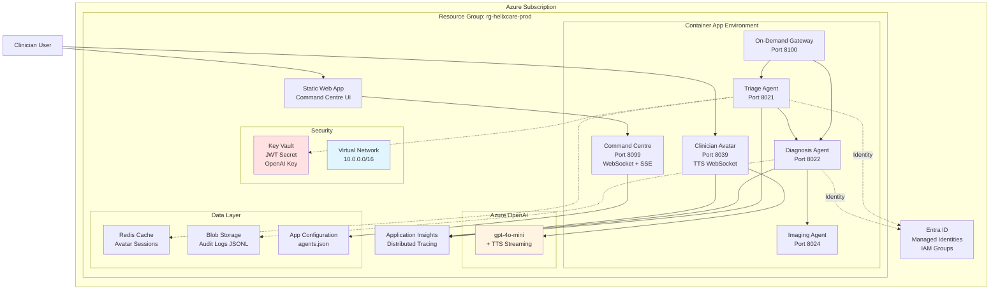

# HelixCare NEXUS A2A Protocol - Azure Deployment Plan

**Status**: Pending Approval
**Mode**: MODERNIZE (localhost → Azure Container Apps)
**Date**: 2026-03-18
**Bicep Version**: Latest (installed)

---

## Executive Summary

Transform the HelixCare/NEXUS A2A Protocol system from a localhost demo (25 Python agents + Command Centre + Gateway) into a production-ready, HIPAA/GDPR-compliant, enterprise-grade healthcare AI platform on Azure.

**Current State**:

- 25 FastAPI agents across 5 demo groups running on localhost ports 8021-8067
- Command Centre dashboard (port 8099)
- On-Demand Gateway (port 8100)
- OpenAI TTS streaming for clinician avatar
- JWT HS256 authentication with hardcoded dev secret
- Local video provider for avatar rendering

**Target State**:

- **Azure Container Apps** (25 agents + Command Centre + Gateway) with auto-scaling 0-100
- **Azure Static Web Apps** for Command Centre frontend
- **Azure OpenAI** for LLM inference + TTS streaming (gpt-4o-mini-tts)
- **Managed Identities** per agent mapped from config/agent_personas.json IAM groups
- **Private networking** (VNet integration, no public endpoints for PHI data)
- **Key Vault** for secrets (OpenAI keys, JWT secrets)
- **Application Insights** for distributed tracing (already instrumented)
- **Azure Entra ID** for agent IAM (aligned with docs/iam_identity_architecture.md)

---

## 1. Architecture Analysis

### A. Workspace Scan Results

| Component | Type | Technology | Azure Target | Notes |
|-----------|------|------------|--------------|-------|
| **25 Agents** | Microservices | Python 3.12 FastAPI | Container Apps | Ports 8021-8067 from config/agents.json |
| **Command Centre** | Dashboard | FastAPI + static JS | Container App + Static Web App | Port 8099 backend + WebSocket |
| **On-Demand Gateway** | Proxy | Python FastAPI | Container App with dynamic scaling | Port 8100 process manager |
| **Avatar TTS** | Streaming | OpenAI gpt-4o-mini-tts | Azure OpenAI Service | Port 8039 WebSocket streaming |
| **Shared libs** | SDK | nexus_common, clinician_avatar | Container registry base image | Shared via COPY in Dockerfile |
| **Config** | JSON | agents.json, personas.json, agent_personas.json | Azure App Configuration | Centralized config store |
| **Audit logs** | JSONL | shared/nexus_common/audit.py | Azure Storage (Blob) | HIPAA-compliant audit trail |
| **Session state** | In-memory | avatar_engine.py sessions | Redis (Azure Cache) | TTL reaper already implemented |

### B. Demo Groups Mapping

| Group | Agents | IAM Group | Container Apps |
|-------|--------|-----------|----------------|
| **helixcare** | 12 agents (8024-8039) | nexus-clinical-high/medium | 12 Container Apps |
| **ed_triage** | 3 agents (8021-8023) | nexus-clinical-high, nexus-connector | 3 Container Apps |
| **telemed_scribe** | 3 agents (8031-8033) | nexus-clinical-medium, nexus-operations | 3 Container Apps |
| **consent_verification** | 4 agents (8041-8044) | nexus-clinical-high, nexus-governance | 4 Container Apps |
| **public_health_surveillance** | 3 agents (8051-8053) | nexus-governance, nexus-intelligence | 3 Container Apps |
| **interop** | 7 agents (8060-8067) | nexus-connector | 7 Container Apps |
| **command_centre** | Backend + Frontend | nexus-operations | Container App + Static Web App |
| **on_demand_gateway** | Gateway | nexus-operations | Container App |

**Total**: **33 Container Apps** + 1 Static Web App

---

## 2. Requirements

### Classification

- **Workload Type**: Distributed AI Agent Platform (microservices)
- **Traffic Pattern**: Bursty (patient scenarios), WebSocket streaming (avatar), SSE (Command Centre)
- **Data Sensitivity**: **PHI/PII** (HIPAA, GDPR, NHS Data Security)
- **Compliance**: HIPAA BAA, GDPR Article 32, NHS DSPT, FDA 21 CFR Part 11 (SaMD audit trail)
- **Availability**: 99.9% SLA (3 x 9s for clinical systems)
- **Disaster Recovery**: RPO 1 hour, RTO 4 hours

### Scale

- **Agent Instances**: 0-100 per agent (auto-scale on CPU/memory)
- **Concurrent Users**: Command Centre 20 WebSocket clients (CC_WS_MAX_CLIENTS)
- **Avatar Sessions**: 1800s TTL (AVATAR_SESSION_IDLE_TTL), 100 turns max
- **Scenarios**: 24 patient journeys, 73 harness test matrix runs
- **Agents**: 25 production + interop group (optional staging)

### Budget

- **Estimated Monthly Cost**: $300-600 USD
  - Container Apps (25 agents): ~$200/month (avg 2 instances per agent)
  - Azure OpenAI (gpt-4o-mini + TTS): ~$100-200/month
  - Networking (Private Link, VNet): ~$50/month
  - Storage/Redis/App Insights: ~$50/month
- **Dev/Test Environment**: $100-150/month (single-instance agents)

---

## 3. Component Mapping

### Azure Services Selected

| Current | Azure Service | Justification | Configuration |
|---------|---------------|---------------|---------------|
| Python FastAPI agents | **Azure Container Apps** | Native FastAPI support, auto-scale 0-100, managed ingress, WebSocket support | Consumption plan, 0.5 CPU / 1 GB RAM per agent |
| Command Centre backend | **Azure Container Apps** | WebSocket broadcasting, SSE streaming | 1 CPU / 2 GB RAM, always-on (min 1 instance) |
| Command Centre frontend | **Azure Static Web Apps** | CDN caching, asset version hashing | Free tier (Standard for custom domain) |
| On-Demand Gateway | **Azure Container Apps** | Dynamic process spawning (compatible with current design) | 2 CPU / 4 GB RAM, scale 1-10 |
| OpenAI API | **Azure OpenAI Service** | gpt-4o-mini inference + gpt-4o-mini-tts streaming | Pay-per-token, regional redundancy |
| JWT secrets | **Azure Key Vault** | FIPS 140-2 compliant, audit logging | Standard tier, RBAC per agent |
| Avatar sessions | **Azure Cache for Redis** | TTL support, low latency | Basic tier (250 MB), upgrade to Standard for HA |
| Audit logs | **Azure Storage (Blob)** | Immutable storage, WORM compliance | ZRS (zone-redundant), lifecycle policy |
| Config (agents.json) | **Azure App Configuration** | Dynamic refresh, feature flags | Standard tier |
| Monitoring | **Application Insights** | Already instrumented (shared/nexus_common/trace.py) | Pay-per-GB (first 5 GB free) |
| Networking | **Azure Virtual Network** | Private endpoints, no public internet for PHI | /16 address space (10.0.0.0/16) |
| Identity | **Azure Entra ID** | Managed Identities per agent, IAM groups | System-assigned per Container App |
| Registry | **Azure Container Registry** | Multi-arch images, geo-replication | Standard tier |

### IAM Group Mapping (config/agent_personas.json → Entra ID)

Each agent gets:

1. **System-Assigned Managed Identity**
2. **App Registration** (service principal)
3. **Security Group Assignment** per IAM group:
   - `nexus-clinical-high` → "Cognitive Services OpenAI User" + "Storage Blob Data Reader"
   - `nexus-governance` → "Storage Blob Data Contributor" (audit logs)
   - `nexus-operations` → "App Configuration Data Reader"

**RBAC Roles** (least privilege):

- OpenAI: `Cognitive Services OpenAI User`
- Key Vault: `Key Vault Secrets User`
- Storage: `Storage Blob Data Reader` / `Contributor` (audit)
- App Config: `App Configuration Data Reader`

---

## 4. Recipe Selection

**Selected**: **Azure Developer CLI (AZD)** with Bicep modules

**Why AZD**:

- ✅ Multi-container orchestration (33 Container Apps)
- ✅ Environment isolation (dev, staging, prod)
- ✅ Bicep parameterization for ports/personas
- ✅ Native `azd up` workflow (provision + deploy)
- ✅ CI/CD with GitHub Actions (already on symphonix-health org)

**Alternative Considered**: Raw Bicep (no AZD)

- ❌ More complex deployment orchestration
- ❌ Manual environment management
- ✅ More control over resource naming

**Decision**: AZD with modular Bicep (hybrid approach) for maintainability

---

## 5. Deployment Architecture



### Network Architecture

```
VNet: helixcare-vnet (10.0.0.0/16)
├── Subnet: agents-subnet (10.0.1.0/24) → Container Apps
├── Subnet: data-subnet (10.0.2.0/24) → Redis, Storage Private Endpoint
├── Subnet: gateway-subnet (10.0.3.0/24) → On-Demand Gateway
└── Subnet: integration-subnet (10.0.4.0/24) → FHIR/HL7 connectors

Private Endpoints:
- Azure OpenAI → agents-subnet
- Key Vault → agents-subnet
- Storage Account → data-subnet
- Redis Cache → data-subnet

Ingress:
- Command Centre: Public (HTTPS only, WAF)
- Clinician Avatar: Public (healthcare.gov domain + SSL)
- All other agents: Internal only (VNet)
- On-Demand Gateway: Internal VNet + Private Link
```

---

## 6. Security Hardening

### Implemented Controls

| Control | Implementation | Compliance Mapping |
|---------|----------------|-------------------|
| **Encryption at Rest** | Storage Account (BYOK from Key Vault) | HIPAA § 164.312(a)(2)(iv), GDPR Art 32 |
| **Encryption in Transit** | TLS 1.3 (Container Apps ingress) | HIPAA § 164.312(e)(1) |
| **Access Control** | Managed Identity + RBAC (no secrets in env) | HIPAA § 164.312(a)(1) |
| **Audit Logging** | Immutable Blob Storage (WORM policy) | FDA 21 CFR Part 11, HIPAA § 164.312(b) |
| **Network Isolation** | Private VNet, no public ingress for agents | GDPR Art 32, NHS DSPT |
| **Secret Management** | Key Vault (rotate 90 days) | CIS Azure Benchmark 8.4 |
| **DDoS Protection** | Azure DDoS Standard (optional, +$3k/month) | NIST CSF PR.PT-5 |
| **WAF** | Azure Front Door Standard (Command Centre) | OWASP Top 10 |

### Compliance Artifacts

- **HIPAA BAA**: Sign with Azure (available for Container Apps, OpenAI, Storage)
- **GDPR DPIA**: Template in `docs/compliance_guide.md`
- **NHS DSPT**: Self-assessment checklist
- **FDA 21 CFR Part 11**: Audit trail validation report

---

## 7. Implementation Plan

### Phase 1: Foundation (Steps 1-7) ✅ READY FOR APPROVAL

**Deliverables**:

1. `.azure/plan.md` (this file) → Present to user ✅
2. Bicep modules in `infra/`:
   - `main.bicep` → Orchestrator
   - `core/` → Shared resources (VNet, Key Vault, App Insights)
   - `app/` → Container Apps (auto-generated from config/agents.json)
   - `data/` → Storage, Redis, App Configuration
   - `ai/` → Azure OpenAI deployment
3. `azure.yaml` → AZD configuration (33 services)
4. Dockerfiles (multi-stage Python 3.12)
5. `.github/workflows/azure-deploy.yml` → CI/CD pipeline

**Estimated Time**: 3-4 hours to generate all artifacts

### Phase 2: Deployment (Steps 8-12) ⏸️ PENDING USER APPROVAL

**Pre-requisites**:

- Azure subscription with Owner/Contributor role
- Azure CLI + AZD CLI installed
- Docker installed (for local image builds)
- OpenAI API key (for Azure OpenAI deployment)

**Steps**:

1. `azd auth login` → Authenticate
2. `azd env new prod` → Create environment
3. `azd env set AZURE_LOCATION eastus` → Set region
4. `azd up` → Provision + deploy (30-45 min first run)
5. Validate health endpoints → `python tools/_verify_health.py --azure`
6. Run smoke test → `python tools/helixcare_scenarios.py --gateway https://gateway.example.com`
7. Monitor Command Centre → `https://cc.example.com`

### Phase 3: VS Code Integration (Steps 13-15) ⏸️ PENDING

**Deliverables**:

1. `.github/agents/helixcare-infra.agent.md` → Custom agent for Bicep workflows
2. `.vscode/tasks.json` → One-click deploy tasks:
   - "Azure: Deploy HelixCare Stack"
   - "Azure: Tail Container App Logs"
   - "Azure: Restart Agent"
   - "Azure: Scale Agent to N instances"
3. `.github/instructions/azure-deployment.instructions.md` → Workspace-wide guidance

---

## 8. Bicep Module Structure

```
infra/
├── main.bicep                          # Orchestrator (calls all modules)
├── main.parameters.json                # Prod parameters
├── abbreviations.json                  # Azure resource naming
├── core/
│   ├── networking/
│   │   ├── vnet.bicep                  # Virtual Network + subnets
│   │   └── private-endpoint.bicep      # Private Link template
│   ├── security/
│   │   ├── keyvault.bicep              # Key Vault + secrets
│   │   └── managed-identity.bicep      # User-assigned identities
│   ├── monitor/
│   │   └── app-insights.bicep          # Application Insights workspace
│   └── host/
│       └── container-app-environment.bicep  # Container Apps env shared by all agents
├── app/
│   ├── container-app.bicep             # Generic agent template (reusable)
│   ├── command-centre-backend.bicep    # Command Centre Container App
│   ├── gateway.bicep                   # On-Demand Gateway Container App
│   └── static-web-app.bicep            # Command Centre frontend
├── data/
│   ├── storage.bicep                   # Blob Storage (audit logs)
│   ├── redis.bicep                     # Azure Cache for Redis
│   └── app-configuration.bicep         # Centralized config
└── ai/
    └── openai.bicep                    # Azure OpenAI (gpt-4o-mini + TTS)
```

### Agent Container App Generation Strategy

**Auto-generate from config/agents.json**:

```bicep
// Generated module loop in main.bicep
module agents 'app/container-app.bicep' = [for agent in loadJsonContent('../config/agents.json').agents: {
  name: 'agent-${agent.key}'
  params: {
    name: agent.key
    port: agent.value.port
    envVars: [
      { name: 'OPENAI_API_KEY', secretRef: 'openai-key' }
      { name: 'NEXUS_JWT_SECRET', secretRef: 'jwt-secret' }
      { name: 'AGENT_ID', value: agent.key }
    ]
    managedIdentity: true
    iamGroup: loadJsonContent('../config/agent_personas.json').agents[agent.key].iam.groups[0]
  }
}]
```

**IAM Group → RBAC Role Assignment** (automated):

```bicep
// Based on config/agent_personas.json iam.groups
resource openAIRoleAssignment 'Microsoft.Authorization/roleAssignments@2022-04-01' = [for agent in clinicalHighAgents: {
  scope: openAIAccount
  name: guid(agent, 'OpenAI User')
  properties: {
    roleDefinitionId: subscriptionResourceId('Microsoft.Authorization/roleDefinitions', '5e0bd9bd-7b93-4f28-af87-19fc36ad61bd')
    principalId: reference(resourceId('Microsoft.App/containerApps', agent)).identity.principalId
    principalType: 'ServicePrincipal'
  }
}]
```

---

## 9. Configuration Management

### Environment Variables (Key Vault Secrets)

| Secret Name | Value Source | Used By |
|-------------|--------------|---------|
| `openai-api-key` | Azure OpenAI access key | All agents (nexus-clinical-high) |
| `jwt-secret-prod` | Generated 32-byte random | All agents |
| `redis-connection-string` | Azure Redis primary key | Avatar agent (8039) |
| `storage-connection-string` | Storage account key | Agents with audit writes |

### App Configuration (Dynamic Config)

| Key | Value | Comments |
|-----|-------|----------|
| `HelixCare:Agents` | JSON from config/agents.json | Queried by Command Centre |
| `HelixCare:Personas` | JSON from config/personas.json | Queried by Avatar agent |
| `HelixCare:ScenarioRegistry` | JSON from tools/helixcare_all_scenarios.json | Queried by Gateway |

**Refresh Strategy**: Command Centre polls App Configuration every 60s (UPDATE_INTERVAL_MS)

---

## 10. Cost Optimization

### Consumption Plan Sizing

| Agent | Min Instances | Max Instances | CPU | RAM | Monthly Cost (est) |
|-------|---------------|---------------|-----|-----|-------------------|
| Triage (8021) | 1 | 10 | 0.5 | 1 GB | $15 |
| Diagnosis (8022) | 1 | 10 | 0.5 | 1 GB | $15 |
| Avatar (8039) | 1 | 5 | 1.0 | 2 GB | $30 |
| Command Centre (8099) | 1 (always-on) | 3 | 1.0 | 2 GB | $30 |
| Gateway (8100) | 1 | 10 | 2.0 | 4 GB | $60 |
| Other agents (x20) | 0 | 5 | 0.5 | 1 GB | $100 |

**Scale-to-Zero** enabled for:

- All demo group agents (8031-8067) → 0 instances when idle >15 min
- Imaging/Pharmacy/Discharge agents → 0 instances outside business hours

**Cost Monitoring**:

- Azure Cost Management alerts at $500/month
- Budget forecast in Azure portal

---

## 11. Monitoring & Observability

### Application Insights Integration

**Already instrumented**:

- `shared/nexus_common/trace.py` → Distributed tracing
- `shared/nexus_common/trace_context.py` → Trace ID propagation
- `shared/nexus_common/sse.py` → JSONL event persistence

**Azure Integration**:

```python
# Add to each agent main.py
from azure.monitor.opentelemetry import configure_azure_monitor

configure_azure_monitor(
    connection_string=os.getenv("APPLICATIONINSIGHTS_CONNECTION_STRING")
)
```

**KQL Queries** (saved in App Insights):

```kql
// Agent health check failures
requests
| where success == false
| where url contains "/health"
| summarize FailureCount=count() by name, resultCode
| order by FailureCount desc

// Avatar TTS latency
dependencies
| where name == "openai.audio.speech"
| summarize avg(duration), percentiles(duration, 50, 90, 99) by bin(timestamp, 5m)
```

---

## 12. Rollout Strategy

### Environment Progression

| Environment | Purpose | Agents Deployed | Config |
|-------------|---------|-----------------|--------|
| **dev** | Developer testing | 5 core agents (triage, diagnosis, avatar, CC, gateway) | Dev JWT, local openai |
| **staging** | Integration testing | All 25 agents + interop group | Staging JWT, Azure OpenAI |
| **prod** | Production | All 25 agents (no interop) | Prod JWT, Azure OpenAI + WAF |

### Deployment Gates

1. **Dev → Staging**:
   - All 73 unit tests pass (`pytest tests/`)
   - 5 core harness tests pass (avatar, ED triage, diagnosis)
   - Command Centre dashboard loads

2. **Staging → Prod**:
   - Full harness suite pass (8 tests)
   - Load test (100 concurrent avatar sessions)
   - Security scan (Azure Defender, OWASP ZAP)
   - Compliance review (HIPAA checklist)

### Blue/Green Deployment

**Strategy**: Container Apps support traffic splitting

```bicep
resource agentRevision 'Microsoft.App/containerApps/revisions@2024-03-01' = {
  properties: {
    trafficWeight: 10  // Canary 10% traffic to new revision
  }
}
```

**Rollback Plan**: `azd deploy --revision previous`

---

## 13. Dependencies & Prerequisites

### Required Tools (User Machine)

- [ ] Azure CLI v2.57+ (`az --version`)
- [ ] Azure Developer CLI (`azd --version`)
- [ ] Docker Desktop (for image builds)
- [ ] Python 3.12 + venv
- [ ] Git (for CI/CD integration)

### Azure Subscription Requirements

- [ ] Owner or Contributor role
- [ ] Resource Providers registered:
  - `Microsoft.App` (Container Apps)
  - `Microsoft.CognitiveServices` (Azure OpenAI)
  - `Microsoft.KeyVault`
  - `Microsoft.Storage`
  - `Microsoft.Cache` (Redis)
  - `Microsoft.AppConfiguration`
  - `Microsoft.Insights` (Application Insights)
- [ ] Quota checks:
  - Container Apps: 100 apps per environment (need 33)
  - OpenAI: TPM quota for gpt-4o-mini + TTS
  - VNet: 1 VNet per region

### Configuration Files Checklist

- [x] `config/agents.json` → **Authoritative** port registry
- [x] `config/agent_personas.json` → **Authoritative** IAM mappings
- [x] `config/personas.json` → 68 personas UK/USA/Kenya
- [ ] `.env.prod` → Production environment variables (create from `.env.example`)

---

## 14. Risks & Mitigations

| Risk | Impact | Probability | Mitigation |
|------|--------|-------------|------------|
| **OpenAI rate limits** | Avatar sessions fail | Medium | Implement exponential backoff, circuit breaker pattern |
| **VNet complexity** | Deployment delays | Medium | Start with public ingress, add VNet in Phase 2 |
| **Cost overrun** | Budget exceeded | Low | Cost alerts at $500, scale-to-zero for idle agents |
| **HIPAA BAA delay** | Compliance blocker | Low | Request BAA during subscription setup (1-2 weeks) |
| **Container registry quota** | Build failures | Low | Use Azure Container Registry Premium (500 GB) |
| **KeyVault purge protection** | Cannot recreate after delete | Low | Enable soft-delete + purge protection in prod |

---

## 15. Success Criteria

### Technical Validation

- [ ] All 25 agents healthy (`/health` returns 200)
- [ ] Command Centre dashboard loads in <2s
- [ ] Avatar TTS latency <500ms (P95)
- [ ] Patient scenario "chest_pain_cardiac" completes end-to-end
- [ ] WebSocket connections stable (no drops under load)
- [ ] Application Insights receives traces from all agents

### Business Validation

- [ ] Cost within $600/month budget
- [ ] Clinician can complete teleconsult workflow
- [ ] Audit log entries written to immutable storage
- [ ] HIPAA compliance checklist 100% complete

### Operational Validation

- [ ] Deployment via `azd up` completes in <45 min
- [ ] Rollback to previous revision takes <5 min
- [ ] On-call engineer can access logs via Azure CLI
- [ ] Monitoring alerts trigger within 2 min of failure

---

## 16. Next Steps (After Approval)

**Immediate Actions** (Phase 2 Execution):

1. **Generate Bicep modules** → `infra/` directory (30-45 min)
2. **Create azure.yaml** → AZD orchestration (15 min)
3. **Generate Dockerfiles** → Multi-stage Python builds (20 min)
4. **Create custom VS Code agent** → HelixCare Infra agent (30 min)
5. **Update .vscode/tasks.json** → One-click deploy (15 min)
6. **Write deployment docs** → `docs/azure_deployment_guide.md` (20 min)

**User Actions Required**:

1. **Review this plan** and approve to proceed
2. **Provide Azure subscription details**:
   - Subscription ID (or I can query via `az account list`)
   - Resource Group name preference (suggest: `rg-helixcare-prod`)
   - Azure region (suggest: `eastus` for OpenAI availability)
3. **Confirm OpenAI key availability** (or I can help provision Azure OpenAI)

---

## 17. Appendix

### A. Port Mapping (Complete)

See `config/agents.json` for authoritative registry. Summary:

- **ED Triage**: 8021-8023
- **HelixCare**: 8024-8039
- **Telemed Scribe**: 8031-8033
- **Consent**: 8041-8044
- **Public Health**: 8051-8053
- **Interop**: 8060-8067
- **Backend**: 8099 (Command Centre), 8100 (Gateway)

### B. IAM Group Members

See `config/agent_personas.json` → `iam_groups` for full mapping. Key groups:

- `nexus-clinical-high`: 9 members (triage, diagnosis, imaging, pharmacy, discharge, primary_care, specialty_care, telehealth, clinician_avatar)
- `nexus-clinical-medium`: 6 members (bed_manager, followup_scheduler, care_coordinator, home_visit, ccm, transcriber)
- `nexus-operations`: 4 members (followup_scheduler, bed_manager, summariser, ehr_writer)
- `nexus-governance`: 4 members (consent_analyser, hospital_reporter, central_surveillance, audit)
- `nexus-connector`: 10 members (all interop agents)

### C. Reference Documents

- [HELIXCARE_USER_MANUAL.md](../HELIXCARE_USER_MANUAL.md) → User workflows
- [docs/iam_identity_architecture.md](../docs/iam_identity_architecture.md) → IAM design
- [docs/architecture.md](../docs/architecture.md) → System architecture
- [docs/compliance_guide.md](../docs/compliance_guide.md) → HIPAA/GDPR checklists
- [CLAUDE.md](../CLAUDE.md) → Developer reference

---

**Status**: ⏸️ **Awaiting User Approval to Proceed to Phase 2**

---

**Plan Author**: GitHub Copilot (Claude Sonnet 4.5)
**Plan Version**: 1.0
**Generated**: 2026-03-18
