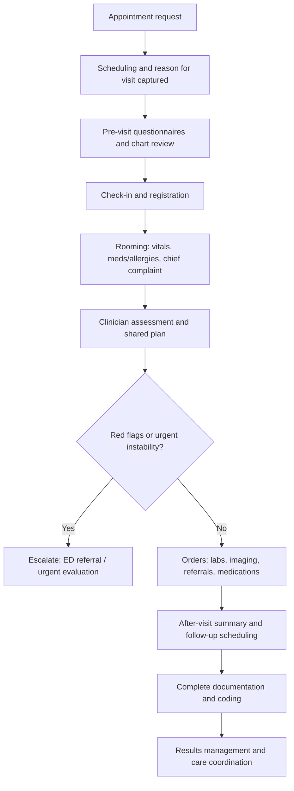
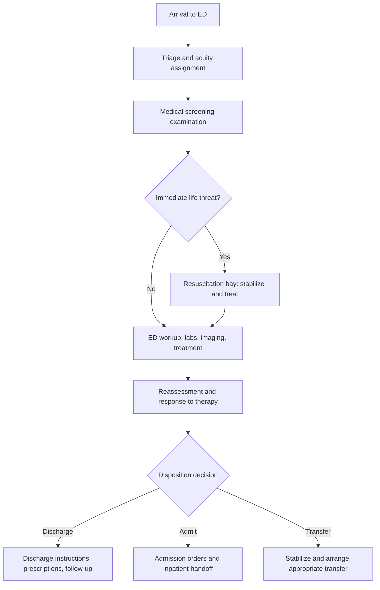
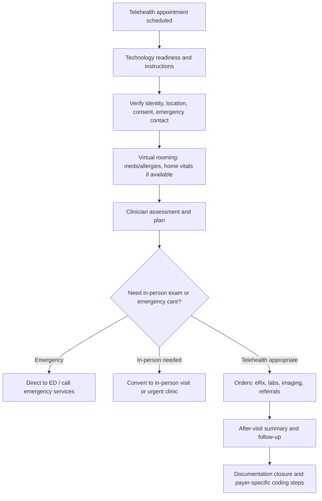

# Patient Visit Scenarios in Healthcare: Workflow, EHR Touchpoints, Time, Billing, and Safety

## Executive summary

Patient “visit scenarios” (in-person, virtual, home-based, emergency, and inpatient) differ in pace, staffing, documentation patterns, and billing rules, yet they share a repeatable backbone: access and intake → clinical assessment and decision-making → orders and interventions → patient communication and care transitions → documentation, coding, and follow-up. Where organisations standardise these building blocks (without flattening clinical nuance), they typically see fewer safety events at handoffs, lower documentation rework, and more predictable throughput—especially when EHR tooling (templates, order sets, interoperability artefacts) is aligned to the workflow rather than the other way around. (World Health Organization [WHO], 2020; Centers for Medicare & Medicaid Services [CMS], 2025). citeturn5search15turn2search0

Across outpatient care, published estimates suggest a typical primary care visit averages about the low‑20‑minute range for clinician time (with wide variation by country and practice design), with specialty visits tending to be somewhat longer on average. (Ku, 2023; Irving et al., 2017). citeturn2search9turn2search21

In emergency care, time urgency and diagnostic uncertainty dominate: national U.S. survey tables show a median wait time to see a clinician in the emergency department (ED) on the order of tens of minutes, while total time spent in the ED is commonly several hours for many visits. (National Center for Health Statistics, 2022). citeturn9view0

Documentation burden is not simply “how long the note is”; it is the cumulative time spent across EHR tasks (reviewing, ordering, inboxing, coordinating, coding). Time‑motion and EHR event‑log studies have shown that ambulatory physicians can spend a large portion of their workday on EHR and desk work, with additional “work after work” in many settings. (Sinsky et al., 2016; Arndt et al., 2017). citeturn2search6turn1search3

Regulatory and billing implications are highly jurisdiction‑dependent. This report stays system‑agnostic but uses U.S. Medicare/CMS materials as a concrete reference point for coding structure (E/M and telehealth rules), and flags EU/UK privacy requirements (GDPR) as a common comparator for data protection obligations. When an item is not universally specified, it is explicitly marked as such. (CMS, 2025; U.K. legislation implementing GDPR Article 9, 2016; U.S. HHS OCR, 2023). citeturn2search0turn3search24turn3search12

## Scope and assumptions

This report analyses representative patient visit scenarios across outpatient and inpatient settings: primary care, specialty clinics, telehealth, home visits, chronic care management (CCM), emergency department care, and inpatient admission/stay/discharge. It is written for healthcare administrators and clinical informaticists who design workflows, staffing models, EHR build, governance, and quality/safety controls. (WHO, 2019; WHO, 2020). citeturn0search3turn5search15

“Typical patient journey steps” are presented as a pragmatic operational sequence (what most patients experience most of the time). “Clinical workflows” are the clinician-facing activities (triage, assessment, ordering, medication management, documentation, handoffs). Time estimates are provided as ranges per step and should be treated as planning heuristics unless explicitly tied to published measurements; variation is expected by patient acuity/complexity, staffing, local policy, and EHR configuration. Where published, scenario-level time distributions are cited (e.g., ED wait and ED length-of-stay distributions from national survey tables). (National Center for Health Statistics, 2022). citeturn9view0

Billing and regulatory content is organised as:
- **US (Medicare/CMS reference point):** E/M visit structures, telehealth modifiers/place-of-service concepts, and CCM service requirements are anchored to CMS MLN materials and related CMS guidance. (CMS, 2025; CMS, 2025). citeturn2search0turn5search5  
- **EU/UK (privacy reference point):** Special category health data processing constraints are anchored to GDPR Article 9 text as presented in UK legislation. (U.K. legislation implementing GDPR Article 9, 2016). citeturn3search24  
- **Unspecified/other:** When rules vary widely (e.g., licensure, payer policy, national service commissioning), the report labels the detail as “jurisdiction-specific / unspecified.” (WHO, 2019). citeturn5search8

EHR touchpoints are described in vendor-neutral terms, illustrated with publicly available examples from major EHR ecosystems—including template and interoperability artefacts from entity["company","Oracle Health","cerner platform brand"] documentation and testing artefacts, entity["company","MEDITECH","ehr vendor"] product materials, and ecosystem-level tooling in entity["company","Epic","ehr vendor"] environments (as described by clinical informatics and partner materials). (Oracle, 2024–2026; MEDITECH, n.d.; ACEP, 2021). citeturn4search1turn4search21turn4search6turn4search0

## Scenario analyses

### Primary care outpatient visit in person

**Typical journey and workflow with time estimates (illustrative ranges)**  
Visit length varies by country and clinic model; published estimates suggest a primary care clinician visit averages around the low‑20‑minute range in some datasets, but real-world operational “door-to-door” time is usually longer once waiting, rooming, and checkout are included. (Ku, 2023; Irving et al., 2017). citeturn2search9turn2search21

| Step | Typical time (min) | EHR/documentation touchpoints | Common decision points/variations |
|---|---:|---|---|
| Appointment request & scheduling | 2–10 | Scheduling, referral intake, reason-for-visit/complaint capture | Same-day/urgent slot vs routine; interpreter need; pre-auth required (payer-specific) |
| Pre-visit data capture (portal/phone) | 5–20 | Questionnaires, screening tools, prior results, problem list reconciliation | New vs established patient; preventive visit vs problem-oriented |
| Check-in / registration | 3–10 | Demographics, insurance verification, consent forms | Eligibility issues; missing ID/coverage |
| Rooming by MA/RN | 5–12 | Vitals, chief complaint, meds/allergies review, history prompts | Elevated vitals triggers protocol (repeat BP, urgent escalation) |
| Clinician evaluation & shared plan | 15–30* | Note template (often SOAP/problem-based), orders, diagnosis/problem list updates | Need for labs/imaging; referral; “red flag” symptoms → ED referral |
| Orders & care coordination | 2–10 | CPOE orders, referral orders, in-basket tasks | Stat vs routine tests; external referrals; care gaps closure |
| Patient instructions & checkout | 3–10 | After-visit summary, follow-up scheduling, patient education materials | Medication changes; follow-up interval choice |
| Post-visit documentation & coding | 5–20+ | Note completion, coding support, inbox tasks | Queries from coders; results follow-up; patient messages |

\*Published “visit duration” values often refer to clinician-facing time; total clinic cycle time is commonly longer and is site-specific. (Ku, 2023). citeturn2search9

**Stakeholders**  
Patient (and caregiver), front desk/registration, medical assistant or nurse, primary care clinician (MD/DO/NP/PA), lab/phlebotomy, imaging, pharmacy, referral coordinators, care manager (when present), coders/billers, and IT/informatics (templates, decision support, interfaces). Team-based chronic care patterns align with the Chronic Care Model concepts (delivery system design + clinical information systems + self-management support), though local implementation varies. (Bodenheimer et al., 2002; ACT Center, n.d.). citeturn6search7turn6search3

**Clinical workflow and EHR touchpoints**  
Primary care is documentation-dense because it blends preventive care, multi-problem management, and longitudinal coordination. EHR event‑log and time‑motion studies show substantial clinician time is spent on EHR and desk work relative to face-to-face time in ambulatory practice, implying that workflow design must account for pre-visit review and post-visit work as first-class steps. (Sinsky et al., 2016; Arndt et al., 2017). citeturn2search6turn1search3

Interoperability touchpoints commonly include referrals, test orders/results, and transitions-of-care documents and notifications (jurisdiction and network dependent). HL7 FHIR-style resource patterns illustrate how “Encounter,” “ServiceRequest,” and “Observation” structures can represent visit context, orders/referrals, and results, respectively, even though actual implementations differ by vendor and region. (HL7, n.d.; HL7 FHIR build, n.d.). citeturn4search19turn4search3turn4search7

**Regulatory/billing implications (US reference; others unspecified)**  
- **US:** Office/outpatient E/M coding reforms allow selection by medical decision-making (MDM) or total time on the date of service, with defined time ranges for common office visit code families; payer policy determines whether time or MDM is used and what add-on rules apply. (American Medical Association [AMA], 2021–2023; CMS, 2025). citeturn3search18turn2search0turn0search12  
- **EU/UK:** No universal billing code set; commissioning and reimbursement are country-specific. Privacy/security obligations for health data are governed by GDPR principles; health data are “special category” data with stricter processing conditions. (U.K. legislation implementing GDPR Article 9, 2016). citeturn3search24  
- **Unspecified:** Prior authorisation rules, preventive service coverage, and documentation rules differ by payer and country.

**Quality and safety risks and mitigations**  
Medication reconciliation gaps and test-result follow-up failures are repeatedly identified as high-risk points in ambulatory care, especially across transitions and multi-provider care. Safety programmes emphasise structured medication reconciliation and learning systems for incidents and near-misses. (WHO, 2019; WHO, 2020; Joint Commission, 2026). citeturn0search3turn5search15turn2search4  
Mitigation strategies that scale operationally include standardised rooming protocols, structured medication lists with reconciliation workflow, closed-loop test tracking, and clinically governed templates (“good defaults”) that reduce omissions without forcing note bloat. (Sinsky et al., 2016; Schnipper et al., 2008). citeturn2search6turn4search12

### Specialty outpatient clinic visit

**Typical journey and workflow with time estimates (illustrative ranges)**  
Specialty visits often front-load chart review and test interpretation; published estimates suggest medical specialty visits may average longer clinician-facing time than primary care in certain datasets. (Ku, 2023). citeturn2search9

| Step | Typical time (min) | EHR/documentation touchpoints | Common decision points/variations |
|---|---:|---|---|
| Referral receipt & triage | 5–20 | Referral reason, pre-visit requirements; external record requests | “Treat first” vs “test first”; urgent triage |
| Pre-visit planning | 10–30 | Review prior imaging/labs/notes; reconcile meds/problem list | Missing outside records; need for updated diagnostics |
| Check-in & rooming | 8–15 | Specialty questionnaires; vitals; meds; device implants | Procedure needs; nursing protocols |
| Specialist assessment & plan | 20–40 | Specialist note templates; diagnosis refinement; risk stratification | Procedure vs medical therapy; shared decision-making |
| Orders, prior auth, coordination | 10–30 | Order sets, referrals, scheduling procedures, authorisation documentation | Payer prior auth; hospital vs outpatient procedure selection |
| Post-visit documentation | 10–25+ | Results interpretation, messages to PCP, patient communications | Multidisciplinary review (tumor board, heart team), jurisdiction-specific |

**Stakeholders**  
Specialists and subspecialty teams, clinic nurses, diagnostics (imaging, labs), surgical/procedural scheduling, prior-authorisation staff, and primary care/referring clinician. Multidisciplinary care increases coordination workload and documentation needs (letters, shared plans). (Bodenheimer et al., 2002). citeturn6search7

**EHR touchpoints and templates**  
Specialty care tends to rely heavily on structured order sets and specialty-specific documentation templates. Vendor ecosystems provide order sets, flowsheets, and documentation tooling; for example, MEDITECH describes delivering standard evidence-based content such as order sets and documentation templates across specialties. (MEDITECH, n.d.). citeturn4search6

For transitions and external communication, continuity-of-care artefacts (e.g., C‑CDA documents such as referral notes and discharge summaries) are commonly used in US interoperability programmes; publicly available testing documentation in Oracle/Cerner contexts references C‑CDA templates for CCD/referral/discharge summary document types. (Oracle, 2024). citeturn4search1

**Regulatory/billing implications (high-level)**  
Specialty billing can use office/outpatient E/M rules (US) when clinic-based and procedural codes when procedures are performed, with documentation needing to support MDM/time and medical necessity. (CMS, 2025; AMA, 2023). citeturn2search0turn3search18  
Prior authorisation processes are payer-specific and frequently a major operational constraint (not universally specified in regulation in this report).

**Risks and mitigations**  
High-risk areas include diagnostic follow-up (tests ordered but not completed or not reviewed), coordination failures between specialist and primary care, and medication interactions when multiple prescribers are involved. Incident reporting and structured learning systems are recommended as organisational infrastructure to detect recurring patterns. (WHO, 2020). citeturn5search15

### Telehealth consult (video; with audio-only variant)

**Typical journey and workflow with time estimates (illustrative ranges)**  
Telehealth use expanded rapidly and remains an important access channel. Evidence syntheses and large observational studies suggest telehealth can achieve similar performance on many quality measures in certain contexts, though results vary by measure type, population, and modality. (Hatef et al., 2024; Baughman et al., 2022). citeturn6search0turn6search4

| Step | Typical time (min) | EHR/documentation touchpoints | Common decision points/variations |
|---|---:|---|---|
| Scheduling & tech readiness | 5–20 | Patient portal invites; device/browser checks; instructions | Video vs phone; language access; caregiver joins |
| Identity, location, and consent | 1–5 | Document patient identity; physical location; consent; emergency contact | Jurisdiction licensure constraints (varies); privacy setting adequate |
| Virtual rooming (MA/RN) | 3–10 | Update meds/allergies; screen symptoms; collect home vitals | Data quality of home vitals; need for in-person exam |
| Clinician assessment & plan | 10–25 | Telehealth note template; MDM; orders; counselling | Convert to in-person; ED referral for red flags |
| Orders & follow-up | 2–10 | eRx; lab/imaging orders; referrals; patient instructions | External lab availability; shipping devices (RPM) |
| Documentation closure & coding | 5–15 | Modality/POS/modifier capture; time documentation (if used) | Payer-specific requirements; audio-only rules |

**Stakeholders**  
Patient (and potentially caregiver), clinician, RN/MA, scheduling/support desk, pharmacy, diagnostics, and IT/security (platform, identity, audit). Patient preferences often favor in-person care for some needs, but willingness varies by situation and patient characteristics. (Predmore et al., 2021). citeturn6search8

**Regulatory/billing implications**  
- **US privacy:** U.S. HHS OCR publishes guidance on HIPAA and telehealth (including audio-only) and outlines expectations once any enforcement discretion periods end; providers are expected to apply reasonable safeguards for protected health information. (U.S. Department of Health and Human Services [HHS] OCR, 2022–2023). citeturn3search12turn3search0  
- **US Medicare telehealth billing:** CMS telehealth materials emphasise place-of-service concepts and modifiers for telehealth, and include modality-specific rules. CMS also highlights certain mental/behavioral telehealth requirements (e.g., in-person visit timing requirements in some cases) as codified at regulation level. (CMS, 2025). citeturn5search5turn1search1  
- **EU/UK privacy:** Health data are special category data under GDPR; lawful basis and safeguards are required, and detailed national health-sector rules vary. (U.K. legislation implementing GDPR Article 9, 2016). citeturn3search24  
- **Licensure/credentialing:** Jurisdiction-specific and not universally specified here.

**Quality and safety risks and mitigations**  
Telehealth risks cluster around misidentification, privacy breaches, incomplete physical exam, and triangulation failures (e.g., patient is not actually alone when sensitive topics are discussed). Mitigations include scripted identity/location verification, emergency escalation protocols, modality-appropriate clinical pathways (what is safe to manage virtually), and platform security governance aligned to applicable privacy law. (HHS OCR, 2023; WHO, 2019). citeturn3search12turn5search8

### Home visit (home-based primary care / house call)

**Typical journey and workflow with time estimates (illustrative ranges)**  
Home visits include meaningful non-clinical time (travel, safety, setup) and often serve high-need patients. Evidence on outcome effects is mixed by programme and population; VA-oriented summaries report reductions in some utilisation and cost metrics in certain comparisons, while other high-need cohorts show more nuanced results. (Jespersen et al., 2025; Kimmey et al., 2023). citeturn6search2turn6search14

| Step | Typical time (min) | EHR/documentation touchpoints | Common decision points/variations |
|---|---:|---|---|
| Patient selection & scheduling | 10–30 | Eligibility flags; risk stratification; routing | Safety screening; required supplies; caregiver availability |
| Travel & arrival | 15–90 (variable) | Often none during travel; mobile access where available | Environmental risks; weather/traffic; cancelled visits |
| Home safety/environmental scan | 3–10 | Document hazards; falls risk; equipment needs | Referral to social services; urgent safety issues |
| Assessment (history, vitals, exam) | 30–75 | Mobile documentation; photos (policy-specific); meds reconciliation | Limited diagnostics; need for ED transfer |
| Care planning & education | 10–25 | Updated care plan; education; caregiver instructions | Goals-of-care discussion; capacity/consent issues |
| Orders & coordination | 10–30 | eRx; lab draws; home health referrals; durable medical equipment | Urgency; supply chain; payer coverage |
| Post-visit documentation | 10–30+ | Complete note; coding; referrals; communications | Offline-to-online sync; incomplete data due to connectivity |

**Regulatory/billing implications (US reference; others vary)**  
- **US:** CMS transmittals and Medicare contractor guidance indicate home services code families are used when E/M services occur in a private residence and are not to be used outside that setting; place-of-service constraints apply. (CMS, 2006; Noridian Medicare, 2025). citeturn6search1turn6search9  
- **2026 structure note (US CPT maintenance):** The AMA has described structural changes where domiciliary/rest home codes were merged with home visit codes and descriptors aligned to standard E/M structure. (AMA, 2026). citeturn6search25  
- **US payment policy trend:** CMS policy updates for CY 2026 include additions such as expansion of an E/M complexity add-on code (G2211) to certain home/residence E/M families. (CMS, 2025). citeturn6search13  
- **Other countries:** Commissioning/payment models vary widely (unspecified).

**Risks and mitigations**  
Home visits raise safety and quality concerns related to clinician safety, medication management in polypharmacy, and fragmented documentation if mobile workflows are weak. Medication safety at transitions is a known high-risk theme; mitigations include structured medication reconciliation, clear escalation pathways, and robust incident learning. (WHO, 2019; WHO, 2020). citeturn0search3turn5search15

### Chronic care management (CCM) and longitudinal care coordination

**Typical journey and workflow with time estimates (CCM is often non–face-to-face)**  
Chronic care management is often best treated as a monthly cycle rather than a single “visit”: patient identification and consent, care plan creation/maintenance, and recurring coordination tasks (medication management, specialist coordination, monitor results, reinforce self-management). The Chronic Care Model frames these as system design elements rather than ad hoc activity. (Bodenheimer et al., 2002; ACT Center, n.d.). citeturn6search7turn6search3

| Step | Typical time (min) | EHR/documentation touchpoints | Common decision points/variations |
|---|---:|---|---|
| Identify eligible patients | 10–30 (per patient, episodic) | Registries, risk scores, problem list review | Inclusion criteria depend on payer/program |
| Obtain consent & explain programme | 5–15 | Consent documentation; enrolment status | Opt-out; caregiver involvement |
| Create/update comprehensive care plan | 20–60 (initial); 10–30 (updates) | Care plan template; problem list; goals; meds; care team list | Complexity tiering; goals-of-care discussions |
| Monthly coordination work | ≥20 (per month, timed in some US codes) | Phone logs, portal messages, task lists, medication reconciliation | Escalate to visit/ED; add remote monitoring |

**US Medicare CCM requirements (reference point)**  
CMS CCM MLN materials emphasise structured care plan elements, consent, and time-based billing constructs for CCM code families (including incremental time coding). CMS CCM FAQs expand operational clarifications. (CMS, 2025; CMS, 2022). citeturn0search2turn0search18  
Outside the US, “CCM” may exist as capitated care management, disease management programmes, or value-based contracts; billing codes are not harmonised (unspecified).

**Quality and safety risks and mitigations**  
Risks concentrate in care fragmentation (multiple prescribers, multiple plans), medication discrepancies at transitions, and alert fatigue if remote monitoring is layered onto CCM without triage design. WHO’s “Medication Without Harm” and transitions-of-care medication safety materials reinforce that discrepancies at transitions are common and that sustained system action is needed. (WHO, 2017–2019). citeturn0search7turn0search3

image_group{"layout":"carousel","aspect_ratio":"16:9","query":["Chronic Care Model diagram","care coordination chronic care management workflow diagram","medication reconciliation transitions of care infographic"],"num_per_query":1}

### Emergency department visit (treat-and-release OR admission)

**Typical journey and workflow with time estimates (national survey anchored)**  
ED workflows are dominated by triage, rapid risk stratification, and parallel processing (workups, treatments, reassessments). Standardised triage tools (e.g., 5-level triage systems like ESI variants) are widely used to prioritise care for those in immediate need. (ESI Handbook, 2023). citeturn1search2

The U.S. NHAMCS 2022 ED tables report a **median wait time to see a clinician of 16 minutes**, with a distribution spanning from <15 minutes through hours for some patients, and show that **time spent in the ED** commonly falls in multi-hour ranges (with sizeable proportions in 2–4 hours, 4–6 hours, and 6–10 hours categories). (National Center for Health Statistics, 2022). citeturn9view0

| Step | Typical time (min) | EHR/documentation touchpoints | Common decision points/variations |
|---|---:|---|---|
| Arrival & quick registration | 2–10 | Demographics capture; wristband/ID; may be abbreviated | Critical patient bypasses full registration |
| Triage & acuity assignment | 3–10 | Triage note; acuity score; initial vitals | Immediate bed vs waiting room; isolation needs |
| Medical screening exam | 5–20 | Document evaluation; initial orders | Required under EMTALA-like rules (US) |
| Diagnostic workup & treatment | 30–240+ | Orders, results, medication administration record, reassessments | Trauma/stroke/sepsis pathways; imaging vs labs-first |
| Disposition decision | 10–45 | ED course; consults; observation vs admit vs discharge | Bed availability; transfer needs |
| Discharge or admission handoff | 10–60 | Discharge instructions, prescriptions, follow-up; or admission orders and handoff note | Pending results follow-up responsibility |

**Stakeholders**  
Patient/caregiver, triage RN, ED nurse team, ED clinician team, lab, radiology, pharmacy, consultants, security, registration, bed management, transport, admitting team, and case management/social work (often). (ESI Handbook, 2023; National Center for Health Statistics, 2022). citeturn1search2turn9view0

**Regulatory/billing implications**  
- **US (EMTALA):** Medicare-participating hospitals offering emergency services have obligations to provide a medical screening exam and stabilising treatment or appropriate transfer when an emergency condition is present, regardless of ability to pay. (CMS, 2025; HHS OIG, 2024). citeturn5search2turn5search6  
- **US (ED billing structures):** ED E/M coding uses defined ED visit code families, and recent E/M guideline updates focus on medically appropriate history/exam and MDM. (AMA, 2023; ACEP, 2023). citeturn3search18turn3search14  
- **Modifier and procedural billing interactions (US example):** CMS transmittals include rules about modifier usage when procedures occur on the same date as ED E/M services. (CMS, 2004). citeturn3search2  
- **Non-US:** Emergency access obligations exist in many countries but legal form differs (unspecified).

**Quality and safety risks and mitigations**  
ED risk is amplified by crowding, frequent handoffs, incomplete histories, and time pressure. Mitigations include standard triage algorithms; protocolised pathways (e.g., chest pain, stroke); closed-loop test result management for pending studies; and incident reporting systems designed to capture learning, not just blame. (ESI Handbook, 2023; WHO, 2020). citeturn1search2turn5search15

### Inpatient admission and inpatient stay (including consults and daily rounds)

**Typical journey and workflow with time estimates (illustrative; site-specific)**  
Inpatient care is an episode with multiple “micro-visits” (admission, daily assessment, consults, procedures, discharge planning). Published, universally generalisable per-step timings are limited; the ranges below are operational heuristics that should be validated with local time studies or EHR event logs. (WHO, 2020). citeturn5search15

| Step | Typical time (min) | EHR/documentation touchpoints | Common decision points/variations |
|---|---:|---|---|
| Admission decision & bed placement | 15–90 | Admit order; bed request; ADT messages | Observation vs inpatient status (jurisdiction/payer-specific) |
| Admission assessment | 30–90 | H&P or admission note template; problem list; orders | Need ICU vs ward; isolation; goals-of-care |
| Nursing intake & care plan | 30–90 | Nursing assessment; care plan; vitals flowsheets | Pressure injury risk protocols; fall risk |
| Medication reconciliation | 10–30 | Med rec module; pharmacy review | High-risk meds; unclear home regimen |
| Daily rounds & reassessment | 10–25 (per clinician touch) | Progress note; order updates; handoff tools | Decompensation triggers rapid response |
| Consultant evaluation | 20–60 | Consult note; recommendations; co-sign workflows | Multiple consults; shared plan alignment |

**EHR touchpoints and documentation requirements (US CoP reference point)**  
CMS Conditions of Participation (CoP) for hospitals specify that medical record entries must be legible, complete, dated/timed, and authenticated, and that the record must support admission/continued stay, diagnosis, progress, and response to services. (42 CFR §482.24, current). citeturn1search0  
CMS also describes CoP requirements for admission/discharge/transfer (ADT) event notifications in certain contexts, emphasizing interoperability expectations for transitions. (CMS, 2025). citeturn1search8

Vendor ecosystems support inpatient workflows via order sets, nursing flowsheets, and documentation templates; for example, MEDITECH describes providing standard order sets and documentation templates, and HL7-style order/result interfaces (and/or FHIR APIs) are common interoperability mechanisms, though implementation varies. (MEDITECH, n.d.; MEDITECH, 2024; HL7, n.d.). citeturn4search6turn4search14turn4search19

**Risks and mitigations**  
Inpatient risks cluster around medication safety (especially admissions/discharge), handoffs between teams, and failure-to-rescue patterns. WHO medication safety work highlights transitions of care as a priority area for reducing medication-related harm, reinforcing a structured approach to med rec and patient/caregiver engagement. (WHO, 2019; WHO, 2017). citeturn0search3turn0search7

### Inpatient discharge and transition to outpatient care

**Typical journey and workflow with time estimates (illustrative; site-specific)**  
Discharge quality depends on planning that starts early, not on a last-hour sprint. Universally generalisable timing is limited; below ranges are operational heuristics. (WHO, 2019). citeturn0search3

| Step | Typical time (min) | EHR/documentation touchpoints | Common decision points/variations |
|---|---:|---|---|
| Discharge readiness assessment | 10–30 | Problem list updates; discharge criteria check | Need rehab/SNF/home health; transportation barriers |
| Medication reconciliation & prescriptions | 15–45 | Discharge med list; eRx; pharmacy counselling | High-risk meds; affordability issues |
| Discharge summary & instructions | 15–45 | Discharge summary template; follow-up plan; pending tests | Pending results ownership; follow-up scheduling |
| Handoff/notifications | 5–20 | CCD/C-CDA; ADT notification; PCP message | External providers; health information exchange availability |

**Billing/regulatory implication examples (US reference point)**  
CMS transmittals and Medicare contractor guidance discuss discharge day management coding constructs and emphasise that discharge day management is a face-to-face E/M service and generally one service is payable per stay (payer policy-specific). (CMS, 2008; Medicare contractor guidance, 2024). citeturn3search3turn3search7  
Documentation still must support completeness and authentication standards under hospital medical record requirements (US CoP reference). (42 CFR §482.24, current). citeturn1search0

**Risks and mitigations**  
Discharge failures drive avoidable harm and utilisation: common failure modes include medication discrepancies, unclear follow-up, and missed pending test results. WHO specifically highlights medication discrepancies across transitions and calls for sustained action to reduce medication-related harm at admission/discharge interfaces. (WHO, 2019). citeturn0search3

## Scenario comparison tables

### Comparative operational profile by scenario

The table below compares scenarios on resource use, typical duration, documentation burden, and billing-code/requirements anchors. “Documentation burden” is expressed as a qualitative tier plus typical documentation artefacts; the qualitative tier is justified by published EHR workload evidence in ambulatory care and by the multi-document nature of ED/inpatient episodes. (Sinsky et al., 2016; Arndt et al., 2017; 42 CFR §482.24). citeturn2search6turn1search3turn1search0

| Scenario | Resource use profile | Typical patient-facing duration* | Documentation burden (relative) | Billing codes/requirements (examples; jurisdiction noted) |
|---|---|---:|---|---|
| Primary care in-person | Clinic room; MA/RN + clinician; labs/imaging as ordered | Clinician time ~15–30; total cycle often 30–90 (site-specific) | **High**: multi-problem note, preventive gaps, inbox follow-up | **US:** Office/outpatient E/M (MDM or time on date); payer rules vary (CMS/AMA) citeturn2search0turn3search18turn0search12 |
| Specialty clinic | Clinic + diagnostics; authorisation/care coordination | Often ~20–40 clinician time (varies by specialty) | **High**: heavy pre-review, test interpretation, coordination | **US:** Office/outpatient E/M and/or procedure codes; medical necessity & payer auth (varies) citeturn2search0turn3search18 |
| Telehealth consult | Platform support; clinician + optional MA/RN; limited on-site resources | Often ~10–25 clinician time | **Medium–High**: modality documentation + orders + follow-up messages | **US:** POS/modifier concepts in CMS telehealth guidance; HIPAA safeguards (US) citeturn5search5turn3search12 |
| Home visit | Travel + supplies; higher non-clinical time; often complex patients | 30–75 in-home + travel | **High**: care coordination + environmental factors + often complex meds | **US:** Home/residence E/M families; must occur in private residence (CMS/contractor); CPT structure updated (AMA) citeturn6search1turn6search9turn6search25 |
| Chronic care management | Care coordinator time; registries; async communication | ≥20 minutes/month (programme-defined; can exceed) | **High (distributed)**: monthly logs, care plan maintenance, communications | **US:** CMS CCM requirements (care plan, consent, timed service constructs) citeturn0search2turn0search18 |
| ED visit | 24/7 ED team; diagnostics; consultants; possible admission | Multi-hour total time common; wait time median in tens of minutes (US survey) | **Very high**: triage + orders + reassessments + disposition + discharge/admit note | **US:** EMTALA MSE/stabilisation duties; ED E/M families based on MDM (AMA/ACEP) citeturn5search2turn9view0turn3search18turn3search14 |
| Inpatient admission/stay | Bed + nursing + multidisciplinary teams; pharmacy; diagnostics | Episode spans days; daily “touches” vary | **Very high**: H&P, progress notes, MAR, nursing flowsheets, consults | **US:** Hospital medical record CoP; initial/subsequent/discharge E/M constructs (CMS) citeturn1search0turn2search0 |
| Inpatient discharge | Discharge planning; pharmacy; case management; transport | Discharge-day activities 30–120+ (site-specific) | **Very high**: discharge summary, med rec, instructions, transition docs | **US:** Discharge day E/M constructs; transitions documentation requirements vary citeturn3search3turn1search0turn4search1 |

\*Durations are scenario summaries; per-step ranges are shown in the scenario sections. ED duration metrics in this report are anchored to NHAMCS distributions (US); outpatient and inpatient “total time” is more site-specific. (National Center for Health Statistics, 2022; Ku, 2023). citeturn9view0turn2search9

### Documentation and EHR burden drivers that matter operationally

Across scenarios, the dominant documentation drivers are: (a) complexity and number of active problems, (b) number of orders/results to manage, (c) number of handoffs/consults, and (d) asynchronous work (messages, refills, prior authorisation, results). Ambulatory studies consistently show substantial EHR time, often exceeding face-to-face time proportions, supporting the operational need to design for pre- and post-visit work. (Sinsky et al., 2016; Arndt et al., 2017). citeturn2search6turn1search3

## Templates and example artefacts

The following are **representative templates and checklists** (not tied to one country’s regulation unless noted). They are intentionally brief and meant to illustrate “real-world” sections and data elements that commonly appear in production systems. Where applicable, elements are grounded in official requirements (e.g., hospital record completeness/authentication) or official programme guidance (e.g., telehealth/RPM/CCM documentation expectations). (42 CFR §482.24; CMS, 2025; CMS, 2025). citeturn1search0turn5search5turn0search2

### Primary care visit note template (problem-oriented SOAP style)

**Header**: Patient identifiers; visit date/time; location; author; supervising clinician if required (jurisdiction-specific).  
**Chief complaint / reason for visit**  
**Subjective**: HPI; interval history; ROS (as clinically appropriate)  
**Objective**: Vitals; focused physical exam; relevant results reviewed  
**Assessment & plan (problem list)** (repeat per problem):
- Problem name (mapped to diagnosis list)  
- Status (stable/worsening/new)  
- Differential / rationale (as needed)  
- Orders: labs/imaging/referrals  
- Medications: start/stop/change; rationale  
- Patient education and shared decision notes  
**Preventive care / gaps**: immunisations, screening reminders (jurisdiction/payer-specific)  
**Medication reconciliation**: performed (yes/no), discrepancies resolved, pharmacy  
**Follow-up**: timeframe; return precautions; pending results plan  
**Coding support note** (optional): MDM elements or total time attestation if time-based billing is used (payer-specific)  

This structure aligns with widely used clinical documentation patterns and supports longitudinal chronic illness management when combined with robust registries and care planning. (Bodenheimer et al., 2002; Sinsky et al., 2016). citeturn6search7turn2search6

### ED triage checklist excerpt (ESI-like 5-level triage pattern)

**Immediate questions**  
- Does the patient require life-saving intervention now?  
- Is the patient high risk, confused/lethargic/disoriented, or in severe pain/distress?  
**Vitals and “danger zone” check**  
**Expected resource needs** (labs, imaging, IV meds, specialty consult)  
**Isolation/infection control flags**  
**Disposition triggers**: direct-to-room vs waiting room; rapid evaluation protocol  

The intent matches published triage guidance: rapidly sort patients, prioritising those most in need of immediate care. (ESI Handbook, 2023). citeturn1search2

### ED provider note skeleton (documenting parallel workups)

- Arrival mode/time; triage acuity  
- Medical screening exam elements (US EMTALA context: document evaluation and stabilisation steps)  
- ED course timeline: key reassessments, response to treatment  
- Differential and rationale for diagnostics  
- Results reviewed (labs/imaging)  
- Consults and discussions  
- Disposition: discharge vs admit vs transfer; risks/benefits explained  
- Discharge instructions (including return precautions) and follow-up responsibility for pending tests  

EMTALA-related obligations (US) emphasise screening and stabilising treatment and appropriate transfer when necessary. (CMS, 2025; HHS OIG, 2024). citeturn5search2turn5search6

### Telehealth visit checklist and note additions

**Pre-visit checklist**
- Verify patient can use video (or plan audio-only if allowed)  
- Confirm interpreter access if needed  
- Confirm safe/private setting  

**Note additions**
- Modality: video vs audio-only  
- Patient identity verification method  
- Patient location (physical address) and emergency contact  
- Consent for telehealth documented (jurisdiction/payer-specific)  
- Limitations of exam noted; plan to convert to in-person if needed  
- Patient instructions delivered via portal/secure channel  

US guidance distinguishes telehealth modalities and discusses HIPAA-consistent telehealth, including audio-only guidance. (HHS OCR, 2023; CMS, 2025). citeturn3search12turn5search5

### Home visit checklist (clinical + environmental)

- Home environment observations relevant to care (fall hazards, food security cues, caregiver support)  
- Medication reconciliation using “brown bag” method  
- Functional assessment (ADLs/IADLs) and falls risk  
- Equipment needs (DME), wound care supplies, monitoring devices  
- Escalation plan (when to call clinic vs EMS)  
- Coordination tasks (home health, social services, specialist follow-up)

Home visit billing constraints (US) include location-of-service restrictions to a private residence for certain code families (illustrative; payer-specific). (CMS, 2006; Noridian Medicare, 2025). citeturn6search1turn6search9

### Chronic care management monthly log and care plan elements (US CCM reference)

**Care plan elements**
- Conditions addressed; patient goals and preferences  
- Medication list and reconciliation status  
- Named care team and roles  
- Planned interventions and monitoring  
- Coordination with external providers  
**Monthly log**
- Date/time of each CCM activity; staff role  
- Activity type: outreach, care coordination, med review, results follow-up  
- Total time accumulated for the month (when a timed billing construct applies)  
- Escalations to face-to-face or ED care

CMS CCM materials describe care plan and time constructs as core elements of CCM services. (CMS, 2025; CMS, 2022). citeturn0search2turn0search18

### Inpatient admission order set (illustrative “starter” order set)

- Admit to service/level of care; diagnosis/problem list  
- Vitals frequency; activity; diet; IV access  
- Labs: CBC/CMP, condition-specific labs  
- Imaging as indicated  
- Medication reconciliation status + inpatient meds  
- VTE prophylaxis (condition-specific)  
- Consults (PT/OT, case management, specialty)  
- Code status/goals-of-care documentation prompt  
- Nursing protocols (falls, pressure injury risk)

Order sets and standard templates are common EHR capabilities in inpatient settings across vendors. (MEDITECH, n.d.; Hulse et al., 2017). citeturn4search6turn4search17

## Flowcharts and cross-cutting design notes

### Primary care visit flowchart (mermaid)

Primary care flow design should explicitly allocate capacity for pre-visit review and post-visit results/inbox work because published ambulatory studies show substantial time is spent in EHR and desk work beyond face-to-face time. (Sinsky et al., 2016; Arndt et al., 2017). citeturn2search6turn1search3

### Emergency department visit flowchart (mermaid)

In the US, EMTALA frames the duty to screen and stabilise or transfer appropriately, and national survey data provide evidence that ED cycles commonly span multiple hours. (CMS, 2025; National Center for Health Statistics, 2022; HHS OIG, 2024). citeturn5search2turn9view0turn5search6

### Telehealth consult flowchart (mermaid)

Telehealth governance should include privacy safeguards and modality documentation; US OCR and CMS guidance emphasise HIPAA-consistent telehealth practices and telehealth-specific billing concepts. (HHS OCR, 2023; CMS, 2025). citeturn3search12turn5search5

### Cross-cutting safety and mitigation patterns that scale

High-leverage mitigations repeat across scenarios: structured medication reconciliation at transitions, reliable patient identification, closed-loop results follow-up, and an organisational incident reporting and learning system that turns events into design changes. WHO specifically emphasises medication safety at transitions and publishes incident reporting system guidance to support structured learning. (WHO, 2019; WHO, 2020). citeturn0search3turn5search15

Accreditation and safety goal frameworks (programme-specific and evolving by year) commonly reinforce these themes—patient identification, medication safety, and communication. Recent Joint Commission materials for 2026 continue to foreground medication reconciliation as a safety issue, while also describing structural updates to how goals are organised. (Joint Commission, 2025–2026). citeturn2search4turn2search12turn2search20