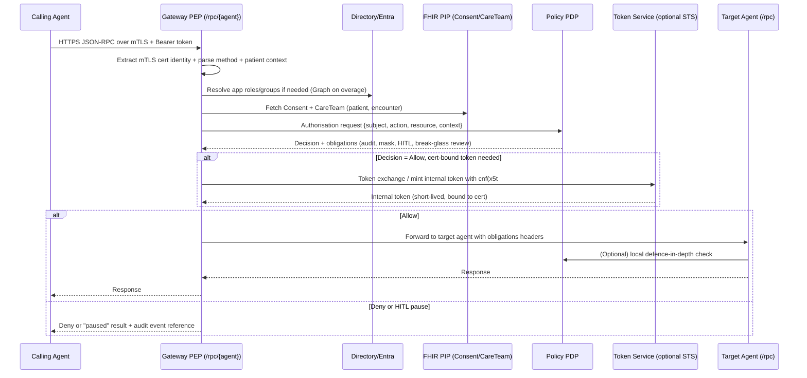

# Enterprise policy layer for patient-level constraints in a NEXUS-A2A multi-agent healthcare system

## Executive summary

A workable enterprise policy layer for patient-level constraints in a multi-agent care-coordination system is best treated as a **separate authorisation control plane**, not “extra logic” inside each agent. The repository already contains the building blocks for this: agent-to-persona mappings, baseline scopes/roles, gateway routing, and an extensible agent runtime with a single place to enforce bearer-token checks. fileciteturn48file1L1-L260 fileciteturn49file0L1-L450 fileciteturn46file0L1-L220 fileciteturn20file17L1-L235

To add **patient-level constraints** (consent, care-team membership, purpose-of-use, break-glass), you need: (a) a **Policy Decision Point (PDP)** that can evaluate ABAC/ReBAC logic using authoritative data sources, (b) **Policy Enforcement Points (PEPs)** placed at every trust boundary (gateway and agent endpoints), and (c) **Policy Information Points (PIPs)** that resolve patient context and entitlements from FHIR and directory sources. This aligns with established ABAC/XACML/PEP–PDP patterns (NIST; XACML) and with modern “policy-as-code” patterns (OPA/Cerbos) suited to microservices and agent meshes. citeturn6search48turn3search2turn5search5turn3search9

The identity model that fits your stated goal—**mTLS workload identity** plus **Active Directory / Entra ID personas**—is:  
1) **mTLS** authenticates the *workload* (agent process) via X.509 at the transport boundary;  
2) **Entra ID** authorises the *persona* via app roles / scopes in access tokens;  
3) the PDP consumes both and returns allow/deny plus obligations (audit, redaction, HITL, break-glass review), with the option to issue **certificate-bound internal tokens** so that bearer replay is materially harder. citeturn0search0turn1search0turn1search1

Where humans are in the loop, you should represent “acting on behalf of clinician X” using delegated user flows (OBO) **only when a user token is present**; the Microsoft documentation is explicit that OBO is a delegated flow and not a general service-principal-to-service-principal chaining technique. For machine-only chaining between agents, use client credentials plus **token exchange (RFC 8693)** and/or an internal STS that mints “downstream” tokens with constrained scopes and explicit actor/chain context. citeturn1search2turn4search2turn4search0

## Repository baseline relevant to policy enforcement

The repo’s current runtime and configuration already expresses many of the artefacts your new policy layer must read and/or enforce:

The **agent persona and IAM schema** is explicit: `config/agent_personas.json` maps each agent to a clinical persona, IAM groups, delegated scopes, purpose-of-use, allowed delegations, and communication permissions (email/SMS). That is effectively an initial **PAP-like** policy source for coarse capabilities and persona boundaries. fileciteturn49file0L1-L450

The **identity architecture document** proposes registering each agent as an Entra App Registration / Service Principal, assigning app roles, using Managed Identity where possible, and applying Conditional Access and audit. It also sketches persona mapping and delegation-chain claims for a NEXUS JWT. This is highly aligned with your “enterprise personas side-by-side with humans” direction. fileciteturn48file1L1-L260

The **generic agent runtime** (`shared/nexus_common/generic_demo_agent.py`) shows a single, reusable place where inbound requests are authenticated (`verify_service_auth`) and where patient context is already extractable from the JSON-RPC task payload (`patient_id` extraction), which is exactly what a patient-level PEP needs to pass to a PDP call. fileciteturn46file0L1-L120

The **RBAC helper** (`shared/nexus_common/rbac.py`) models scope requirements, RBAC levels, data sensitivity, and purpose-of-use, and performs method-level checks against token claims. Even if you supersede it with an external PDP, this module is a useful “local enforcement” layer for defence-in-depth and a template for what inputs matter. fileciteturn48file3L1-L340

The **on-demand gateway** is an obvious gateway-level PEP: it is already the single entry point for agent RPC calls in many flows, proxies `/rpc/{agent_alias}`, forwards `Authorization` headers, and supports TLS configuration. This is a natural place to enforce cross-cutting policy before requests reach agents. fileciteturn17file10L1-L110 fileciteturn20file17L1-L235

The repository’s **compliance guide** already establishes the premise that higher-risk actions must be intercepted with a human-in-the-loop “circuit breaker” pattern, and it highlights audit sidecars and pluggable middleware (e.g., redaction). Those are precisely the kinds of **obligations** your PDP should be able to return, not just “allow/deny”. fileciteturn19file0L1-L120

Taken together, the repo is already structured for: **(i)** a central gateway/orchestrator, **(ii)** consistent tokens and scopes, **(iii)** a place to plug in enforcement, and **(iv)** persona modelling. The missing pieces are the enterprise-grade **PDP/PIP/PAP** layer and the patient-specific decision logic plus auditability. fileciteturn48file1L1-L260 citeturn6search48

## Architecture patterns for a patient-level policy layer

This section addresses the required dimension on architecture patterns: centralised PDP/PIP/PAP/PEP, distributed autonomous policy agents, and hybrid models.

A central PDP/PIP/PAP/PEP pattern is the “default” for healthcare-grade authorisation because it supports consistent enforcement and independent audit. NIST’s ABAC framing and XACML-style component definitions align well with the kind of attribute-heavy decisions in patient privacy. citeturn6search48turn6search1turn3search9

In this pattern:

**PAP (policy administration point)**  
Policies are authored, reviewed, versioned, and promoted. In your repo, `config/agent_personas.json` is an early PAP artefact; in production you would move this into versioned policy-as-code repos (OPA Rego, Cerbos YAML, XACML policies) with CI tests. fileciteturn49file0L1-L450 citeturn3search2turn5search10turn3search11

**PIP (policy information point)**  
Fetches attributes needed for decisions: patient consent, care-team membership, encounter context, organisation/site boundaries, sensitivity labels, current shift, emergency flags, and so on. In healthcare, FHIR is a natural PIP substrate: Consent, CareTeam, AuditEvent, provenance, security labels. citeturn6search15turn2search3turn2search1turn2search5turn2search7

**PDP (policy decision point)**  
Evaluates requests structured as `{subject, action, resource, context}` and returns decisions plus obligations. OPA explicitly documents deployment patterns as a PDP and how PEPs query it via REST; Cerbos provides a PDP API for resource checks and planning; AuthzForce provides XACML PDP/PAP capabilities if you need a more formal policy language. citeturn3search2turn5search5turn3search11turn3search4

**PEPs (policy enforcement points)**  
Must sit at every trust boundary. For NEXUS-A2A, that typically means:  
- **Gateway PEP** at `/rpc/{agent}` so denied calls never reach agents. fileciteturn17file10L1-L80  
- **Agent PEP** inside each agent’s `/rpc` handler (defence-in-depth, prevents bypass by direct calls). The generic runtime already has a single `_require_auth` function suitable for injecting a policy check. fileciteturn46file0L120-L220  
- Optional **service mesh / proxy PEP** (Envoy ext_authz + OPA) to enforce L7 policy before application code. citeturn3search1turn3search0

A distributed autonomous policy-agent pattern (“governance agent” / “sentinel agent”) is increasingly used in multi-agent systems to monitor and enforce system-level policy without patching every agent. While many examples are research-led, the concept matches your need: an autonomous policy agent can translate complex consent and care-team semantics into deterministic decisions and can trigger HITL workflows when the situation is ambiguous or high-risk. citeturn7search6turn7search11turn7search10turn7search9

A hybrid gateway + agent enforcement pattern is usually most practical in healthcare:

- **Gateway** does coarse checks: authentication presence, token validity, persona is allowed to call method, scope is present, patient context declared, and obvious denies (e.g., Payment-purpose agent requesting Treatment-only data). fileciteturn20file17L1-L235 fileciteturn48file3L1-L340  
- **Agents** do fine checks close to the data/tool: field-level redaction, consent-restricted data, “break-glass” obligations, and tool invocation policies, since the agent knows exactly what it is about to do (read vs write vs disclose vs message external recipient). fileciteturn19file0L1-L90 citeturn3search2

This hybrid layout is also congruent with strong “verify at every hop” guidance; policy checks should occur at each critical boundary, not only once “at the front door”. citeturn3search8turn7search9

## Identity, tokens, and mapping from mTLS workload identity to Entra persona claims

This section addresses the required dimensions on mapping identity and token exchange patterns, including certificate binding.

### Workload identity via mTLS

If you want mTLS to be your agent workload identity, the key is: your PEP must be able to map the presented client certificate to a stable agent identity (e.g., `agent_id` / `service_principal_id`) at the start of each request.

**Practical mapping choices**  
- **Certificate subject / SAN** contains an immutable agent identifier (agent alias, SPIFFE-like URI, or Entra appId).  
- **Certificate thumbprint** (hash) is treated as the workload identity key and then looked up in a registry (config store, directory, or TPM-backed store).  

This is compatible with OAuth certificate-bound token semantics: RFC 8705 defines the `cnf` claim with `x5t#S256` so a resource server can verify that the bearer token is only usable when the client presents the corresponding certificate. citeturn0search0turn0search4

### Persona identity via Active Directory / Entra ID

The repo’s identity architecture already recommends registering each agent as a service principal in Entra, mapping it to clinical personas and groups, and using Managed Identity in Azure where possible. fileciteturn48file1L1-L210 citeturn1search8

In Entra, **app roles** are a primary mechanism for machine principals to carry authorisation in tokens: Entra emits a `roles` claim for roles granted to a service principal (including managed identities). citeturn1search0

For certificate-based client authentication to Entra, Microsoft documents certificate credentials and the signed JWT assertion model (`private_key_jwt`) as a replacement for secrets in OAuth flows (including client credentials). citeturn1search1

### Why claims alone are insufficient for patient-level controls

Role/scope claims are necessary, but patient-level constraints depend on runtime attributes:

- patient consent can change, be revoked, be scoped by purpose-of-use, and target labelled data. citeturn6search15turn0search1turn2search5turn2search7  
- care-team membership is time-bounded and encounter-scoped. citeturn2search3turn2search2  
- break-glass is explicitly an exception workflow, not an ordinary permission; it requires logging and post-incident review. citeturn7search7turn2search1

So, the right model is:

1) **Authenticate the workload** (mTLS)  
2) **Authorise the persona** (Entra roles/scopes)  
3) **Evaluate patient-level constraints** (PDP with FHIR + directory context)  
4) **Return obligations**: audit event(s), masking, HITL queue, break-glass review  

### Token exchange and delegation patterns that fit agent + human workflows

The identity architecture document sketches OBO-style delegation chains among agents. In Microsoft’s documentation, the **OBO flow is described as delegation of a user identity and delegated permissions through a request chain**; it is not described as a generic service-principal-to-service-principal chaining mechanism. Plan accordingly: use OBO when there is a real human token in the chain; otherwise use other mechanisms. fileciteturn48file1L120-L210 citeturn1search2

A robust pattern for your “agents side by side with humans in the loop” looks like this:

- **Human-initiated clinical action**: user signs in → UI gets user token → agent uses OBO to call downstream APIs/agents with delegated scopes. citeturn1search2  
- **Autonomous agent action**: agent uses client credentials (or managed identity) to obtain an app token that represents the agent persona only. citeturn1search8turn1search0  
- **Agent-to-agent delegation without a user**: use **OAuth Token Exchange (RFC 8693)** (or an internal STS implementing RFC 8693-like semantics) to mint a constrained token with explicit “actor” / “delegation chain” context. citeturn4search2  
- **Certificate binding**: issue internal tokens with RFC 8705 `cnf` claim containing the certificate hash so that stolen tokens cannot be replayed from a different workload identity. citeturn0search0turn0search4

For Entra group claims: do not assume group membership is always embedded in tokens—**group overage** is a documented behaviour. If you rely on groups for policy evaluation, your PIP must be able to query Microsoft Graph when the token carries an overage pointer. citeturn8search0turn8search2turn8search3

For revocation and rapid changes (including “disable agent”, “remove role”, “suspend access”), Continuous Access Evaluation is one Entra mechanism for near-real-time revocation in CAE-enabled resource APIs; where CAE does not apply to your custom APIs, you still need short-lived tokens and/or introspection plus local deny lists and “break-glass escalation” gates. citeturn8search7turn8search8

## Patient-level policy evaluation by autonomous policy agents

This section addresses how autonomous AI policy agents could evaluate consent, care-team membership, purpose-of-use, and break-glass, including data sources, decision logic, ML vs rule-based, auditability, and HITL escalation.

### Authoritative data sources for patient-level decisions

For healthcare-grade correctness, the PDP should treat the following sources as “authoritative”:

- **FHIR Consent** for what the patient has permitted/denied, including purpose-of-use and security label constraints. HL7 explicitly models purpose and security labels on Consent provisions, while also noting that enforcement is out of scope and typically implemented via frameworks such as OAuth or XACML—meaning you must implement the enforcement logic yourself. citeturn6search15turn0search1turn0search7  
- **FHIR CareTeam** for who is legitimately on the care team for a patient/episode, including role and time bounds. citeturn2search3turn2search2  
- **FHIR security labels / DS4P** to represent data segmentation (purpose-of-use, obligations, refrains), which you can then interpret as policy constraints and obligations. citeturn2search5turn2search7turn2search11  
- **FHIR AuditEvent** (and optionally Provenance) for immutable, security-admin-grade audit records describing who did what and why; the spec notes audit records normally should not be modifiable and are intended for security/privacy administrators. citeturn2search1  
- **Directory / IAM** for persona membership, app roles, and dynamic constraints (suspensions, break-glass eligibility), as represented in your repo’s Entra-persona model. fileciteturn48file1L1-L260 citeturn1search0turn1search8

### Decision logic: rule-based first, ML for risk signals

For patient privacy, **rule-based policy** should remain the primary determinant: it is deterministic, testable, and reviewable. Engines like OPA, Cerbos, and AuthzForce are designed to evaluate attribute-heavy policies and return decisions programmatically. citeturn3search2turn5search5turn3search11

Use ML/LLM reasoning only for **supporting** functions that produce *signals* rather than *permissions*, for example:

- anomaly detection (“this access request behaviour diverges from normal”) to increase scrutiny;  
- semantic parsing of free-text consent documents into structured constraints (with human confirmation);  
- risk scoring to decide whether to require HITL approval, not to grant access outright.  

This is consistent with the repo’s own compliance perspective: high-risk actions should route through HITL interception, and auditability is treated as an explicit deployment responsibility. fileciteturn19file0L1-L90 citeturn6search48

Where you do introduce AI reasoning into the policy layer, treat it as an **autonomous policy agent** that outputs explainable intermediate artefacts (“why I think this is treatment vs payment”, “which consent clause is relevant”), but keep the final “allow/deny” in a deterministic evaluation step.

### Evaluating consent, care-team membership, purpose-of-use, and break-glass

A concrete evaluation pipeline (suitable for PDP implementation) is:

**Inputs**  
- *Subject*: agent workload identity (mTLS cert key), Entra service principal ID, persona ID, roles, scopes, purpose-of-use claim, delegation chain (if any). citeturn0search0turn1search0turn8search0  
- *Action*: method invoked (e.g., `encounter.write`, “send discharge summary email”). Your repo already models method-level scopes in RBAC utilities and required invocation scope (`nexus:invoke`) in the generic runtime. fileciteturn46file0L60-L120 fileciteturn48file3L1-L340  
- *Resource*: patient identifier, encounter identifier, data sensitivity/labels, target system (FHIR/EHR/email). Patient ID extraction is already implemented in the generic runtime) and can be normalised for PEP→PDP requests. fileciteturn46file0L1-L60  
- *Context*: time, location/site, emergency flag, declared purpose-of-use, whether a clinician approved (HITL), and whether the request is a disclosure to an external recipient. citeturn2search5turn8search7

**Step 1: Coarse authorisation** (fast)  
- Validate token/claims; ensure persona is permitted to call the method; ensure requested action fits the agent’s allowed scope set; enforce “scopes only narrow, never widen” and delegation constraints as already described in the repo’s identity roadmap. fileciteturn48file1L150-L240

**Step 2: Patient-level checks** (attribute-heavy)  
- **Care-team membership**: confirm that the persona corresponds to a practitioner role on the patient’s CareTeam (or linked encounter/team), within active period. citeturn2search3turn2search2  
- **Consent**: locate applicable Consent resources; evaluate base decision + provisions; ensure purpose-of-use requested does not conflict with consent purpose, and that security labels are compatible with requested action. citeturn6search15turn0search1turn0search7turn2search7  
- **Purpose-of-use**: align declared purpose-of-use (e.g., Treatment vs Payment vs Operations) with both persona constraints and data labels; DS4P provides a conceptual structure for purpose-of-use as a policy control. citeturn2search7turn2search11  
- **Break-glass**: if emergency override is requested, require: (i) explicit justification, (ii) time-bounded access, (iii) enhanced audit, and (iv) mandatory privacy-office review workflow. citeturn7search7turn2search1turn7search7

**Step 3: Obligations and advice**  
Return obligations for the PEP to enforce:
- write `AuditEvent` with full “who/what/when/why” and delegation chain; citeturn2search1  
- enforce redaction/masking obligations for external LLM calls or external disclosure recipients (mirrors repo’s privacy middleware guidance); fileciteturn19file0L20-L60  
- enforce HITL pause for high-risk actions (repo’s “HITL interceptor” pattern). fileciteturn19file0L10-L35

### Human-in-loop escalation triggers

Use HITL escalation when:
- Consent is ambiguous or conflicts exist (multiple active consents; mismatch in purpose). citeturn6search15  
- The request is cross-organisation or cross-boundary disclosure (e.g., sending clinical summaries externally). fileciteturn49file0L1-L450  
- Break-glass is invoked. citeturn7search7  
- Behavioural anomaly detected (optional layer). citeturn6search48

## Implementation blueprint for the symphonix-health/nexus-a2a-protocol repo

This section addresses the requested concrete implementation steps, code-level pointers, and includes the mapping matrix and mermaid flow.

### Components to add

A practical minimal build (fits local + cloud) is:

**Policy PDP service** (new service, could sit under `shared/policy_pdp/` or `services/policy/`)  
- Expose an API compatible with either:
  - **AuthZEN Authorization API** (standardised PEP↔PDP interface), or  
  - an engine-specific PDP API (OPA `POST /v1/data/...`, Cerbos `/api/check/resources`). citeturn5search4turn3search2turn5search5  
- Internally load policy bundles (git-backed), validate and version them, and publish a “policy version” in decision responses.

**PIPs** (libraries + adapters)  
- `pip_fhir.py`: queries Consent and CareTeam (and perhaps Encounter) from a FHIR server; backend services auth can use SMART Backend Services if you need system scopes. citeturn2search13turn6search15turn2search3  
- `pip_directory.py`: resolves Entra app roles and group membership when needed, handling group overage patterns by calling Microsoft Graph. citeturn8search0turn8search3turn1search0  
- `pip_cert_registry.py`: maps mTLS certificate thumbprints / SAN → agent identity record; seed from `config/agent_personas.json` and (later) Entra app IDs. fileciteturn49file0L1-L450

**PEP middleware** (shared library)  
- `shared/nexus_common/policy_enforcement.py` with:
  - extraction of `patient_id`, `encounter_id`, method/action, and target agent;  
  - extraction of subject claims from the bearer token;  
  - extraction of mTLS identity from the request (where deployed behind a proxy, trust forwarded headers only if mutually authenticated upstream);  
  - a call to PDP; and enforcement of obligations (pause/HITL, redaction flag, “deny”). fileciteturn46file0L1-L220 fileciteturn17file10L1-L110

**Gateway PEP integration**  
- In `shared/on_demand_gateway/app/main.py`, intercept `/rpc/{agent_alias}` just after parsing payload but before forwarding:
  - determine canonical agent alias and method name;  
  - call the PDP;  
  - deny fast or forward with obligations headers (e.g., `X-Policy-Decision`, `X-Policy-Version`, `X-Obligations`). fileciteturn20file17L1-L235

**Agent PEP integration**  
- In `shared/nexus_common/generic_demo_agent.py`, after `_require_auth` succeeds and before method execution:
  - build `PolicyInput` and query PDP;  
  - if denied → return JSON-RPC error with structured detail;  
  - if obligations include HITL → publish “paused” event and return 202-like semantics as your compliance guide suggests. fileciteturn46file0L120-L220 fileciteturn19file0L10-L60

### Data model additions

Introduce a clear decision request/response schema (even if you use OPA/Cerbos internally). A portable schema (aligned to AuthZEN’s information model) includes: `subject`, `action`, `resource`, `context`, and returns `decision` plus `obligations`. citeturn5search4turn6search48

Example pseudo-structures (illustrative):

```json
// PolicyDecisionRequest
{
  "subject": {
    "workload_id": "x5t#S256:...",
    "entra_app_id": "...",
    "persona_id": "P001",
    "roles": ["clinician_service.high"],
    "scopes": ["patient.read", "encounter.write"],
    "purpose_of_use": "Treatment",
    "delegation_chain": ["..."]
  },
  "action": {
    "method": "encounter/write",
    "operation": "write"
  },
  "resource": {
    "patient_id": "12345",
    "encounter_id": "E-987",
    "labels": ["R", "TREAT"]
  },
  "context": {
    "break_glass": false,
    "request_time": "2026-02-27T12:00:00Z",
    "caller_agent": "triage_agent",
    "target_agent": "diagnosis_agent"
  }
}
```

### Test strategy to add

Add tests at three layers:

- **Unit tests**: policy evaluation logic (Rego/YAML/XACML) + PIP adapters with mocked FHIR responses.  
- **Contract tests**: gateway and agent PEP both enforce for the same request (deny at gateway; deny at agent when bypassing gateway). The repo already has a testing culture for agent contract and runtime; extend that pattern. fileciteturn46file6L1-L1  
- **Compliance tests**: encode “high-risk action must be paused” and “break-glass requires audit + review” as test cases, aligned with the compliance guide’s matrix concept. fileciteturn19file0L70-L120

### Example mapping matrix: agents → AD/Entra personas → claims/scopes → policy checks

The table below uses the repo’s persona mappings and delegated scopes as the baseline input. fileciteturn49file0L1-L450

| Example agent | Example Entra/AD persona | Minimum claims/roles to assert | Example scopes (illustrative from repo config) | Patient-level checks before allow |
|---|---|---|---|---|
| Triage agent | P004 “Triage Nurse” | `roles=clinician_service.high`, `purpose_of_use=Treatment` | `patient.read`, `encounter.write`, `observation.write` | care-team/episode membership; consent allows Treatment read/write; no break-glass unless justified |
| Diagnosis agent | P001 “Consultant Physician” | `roles=clinician_service.high`, `purpose_of_use=Treatment` | `patient.read`, `encounter.write`, `medicationrequest.write`, `consent.read` | care-team membership; consent + security labels; enforce least-privileged write boundaries |
| Imaging agent | P005 “Radiologist” | `roles=clinician_service.high`, `purpose_of_use=Treatment` | `patient.read`, `imagingstudy.read`, `diagnosticreport.write` | care-team membership or explicit delegated referral; consent permits imaging disclosure to ordering clinician |
| Pharmacy agent | P007 “Pharmacist” | `roles=clinician_service.high`, `purpose_of_use=Treatment` | `patient.read`, `medicationdispense.write` | consent; constrain to medication domain; break-glass only for emergency meds with audit + review |
| Discharge agent | P001 “Consultant Physician” | `roles=clinician_service.high`, `purpose_of_use=Treatment` | `encounter.write`, `consent.read` | consent permits discharge summary disclosure; external email/SMS obligations (masking, recipient allowlist, audit) |
| Follow-up scheduler | P021 “Care Coordinator” / ops | `roles=patient_service` (or medium clinical), `purpose_of_use=Healthcare Operations` | `appointment.write`, `patient.read` | consent for operations-related use; restrict PHI fields; enforce contact-preference consent for SMS/email |
| Care coordinator | P021 “Care Coordinator” | `roles=clinician_service.medium`, `purpose_of_use=Treatment` | `careplan.read/write`, `appointment.write` | patient consent; care-team membership is mandatory; break-glass may be permitted only with senior approval and audit |
| Consent analyser | P013 “Caldicott Guardian / Privacy Officer” | `roles=auditor`, `purpose_of_use=Healthcare Operations` | `consent.read`, `audit.read`, `patient.read` | access only to consent/audit-related data; no clinical write; mandatory audit for all reads |

This matrix is intentionally conservative: it assumes (a) patient-level controls are evaluated for every request, and (b) even “high privilege” clinical personas still require consent and legitimate relationship to the patient (e.g., care-team membership) unless break-glass is invoked. citeturn6search48turn2search3turn6search15

### Request flow mermaid: mTLS → persona → PDP decision → token issuance → enforcement



## Policy engines to use and integration guidance

This section addresses the required dimension on recommending policy engines and how to integrate them.

### Open-source engines

**entity["organization","Open Policy Agent","policy engine"] (OPA)**  
Strong fit if you want policy-as-code (Rego), sidecar deployment, and flexible input documents. OPA documents both “query local sidecar” and Envoy ext_authz patterns; both map cleanly to gateway-level and agent-level PEPs. citeturn3search2turn3search0turn3search1turn3search7

**entity["company","Cerbos","authorization pdp"]**  
Strong fit if you prefer a purpose-built authorisation PDP with a structured API, “principal/resource/actions” batch evaluation, and “plan” queries. It also aligns with AuthZEN (Cerbos documents AuthZEN examples) and has native APIs that are convenient from Python services. citeturn5search5turn5search10turn3search3

**entity["organization","AuthzForce","xacml pdp"]**  
Strong fit if you need formal XACML policy expression, multi-tenant PDP/PAP, and existing XACML ecosystem tooling. XACML can model obligations/advice very explicitly, which can map to your HITL + audit + masking obligations. citeturn3search11turn3search4turn3search10

### Commercial / managed options

**entity["company","Aserto","authorization platform"]**  
Aserto positions its Directory as an authorisation data store supporting RBAC/ABAC/ReBAC, which is relevant if you decide to model patient–care-team relationships and entitlements in a dedicated relationship graph rather than embedding everything in FHIR queries. citeturn5search9

### Standardising PEP↔PDP calls

If you want to keep your architecture vendor-neutral, adopt the **AuthZEN Authorization API** as the “northbound” PDP interface: it formalises the interchange between PEP and PDP, including evaluation and search endpoints (useful for “which patients can this persona access?” queries). The spec was approved as a Final Specification in January 2026. citeturn5search2turn5search4

## Privacy, security, regulatory concerns, and failure modes

This section addresses the required dimensions on privacy/security/regulatory considerations and failure modes with mitigations.

### Privacy, security, and regulatory controls to build in

**Least privilege and “verify every hop”**  
Treat the gateway as helpful but not sufficient: enforce again at the agent endpoint, especially for tool calls that touch PHI. This matches both ABAC guidance on PEP placement (gateway vs in-app) and modern multi-agent security recommendations to enforce at each trust boundary. citeturn6search1turn7search9turn3search8

**Consent provenance and explainability**  
FHIR Consent explicitly models the consent artefact but leaves enforcement out of scope; therefore, your PDP must emit a machine-readable “explanation” sufficient for audit/review (e.g., which Consent id, which provision, which CareTeam membership evidence). citeturn6search15turn0search1

**Immutable audit logs**  
FHIR AuditEvent is designed for “who/what/when/why” and is intended for security/privacy administrators; systems typically should not allow updates/deletes to audit events to preserve integrity. That design matches “immutable audit log” expectations, and you can map policy decisions and break-glass events into AuditEvent records. citeturn2search1

**Token replay and binding**  
Where your threat model includes stolen bearer tokens (especially in distributed agent networks), use certificate-bound access tokens (RFC 8705) for internal calls, or adopt equivalent proof-of-possession mechanisms, so the token alone is not sufficient without the workload’s private key. citeturn0search0turn0search4

**Group membership correctness**  
If you consume group membership from Entra tokens, implement the documented overage-handling logic and consider using app roles in tokens for stable, bounded authorisation claims. citeturn8search0turn8search3turn1search0

**Safety oversight and “break-glass” governance**  
Your compliance guide emphasises HITL for high-risk clinical actions. Break-glass should be treated in the same spirit: explicit warning/justification, time-bounded access, and mandatory post-event review. fileciteturn19file0L10-L60 citeturn7search7

### Failure modes and mitigations

**Agent compromise (stolen cert / node takeover)**  
- Mitigation: certificate rotation, short-lived internal tokens, certificate-bound tokens, anomaly detection on request patterns, and rapid revocation of the Entra service principal or its roles. citeturn0search0turn8search7turn1search0

**Stale care-team membership** (e.g., clinician removed from team but still has access)  
- Mitigation: enforce care-team membership from FHIR as the authority (time-bounded), cache carefully with short TTL, and require “freshness” for high-risk reads/writes. citeturn2search3turn2search2

**Consent revocation lag**  
- Mitigation: treat consent changes as high-priority PIP updates; use short-lived internal tokens; on reads, optionally re-check consent for every request; on writes/disclosures, require re-check in the same transaction. citeturn6search15turn0search1

**Break-glass abuse**  
- Mitigation: strict eligibility (limited personas), mandatory reason codes, time-bounded escalation tokens, automatic alerting, and a “100% reviewed” queue for privacy officers. citeturn7search7turn2search1

**Over-privileged agents due to misconfigured roles/groups**  
- Mitigation: policy-as-code CI tests; separation of duties for PAP changes; continuous compliance testing (repo’s compliance matrix concept), and explicit “deny-by-default” policies for sensitive actions when patient context is missing. fileciteturn19file0L70-L120 citeturn3search2turn6search48

**Policy bypass via direct-to-agent calls**  
- Mitigation: enforce PEP inside agents (not just at gateway). The repo’s shared runtime makes this practical. fileciteturn46file0L120-L220 fileciteturn17file10L1-L80

## References

entity["company","Microsoft","technology company"]. (2024). *Add app roles and get them from a token (Microsoft identity platform).* citeturn1search0

Microsoft. (2024). *Microsoft identity platform certificate credentials.* citeturn1search1

Microsoft. (2025). *Continuous access evaluation in Microsoft Entra.* citeturn8search7

Microsoft. (2024). *Access token claims reference (groups overage claim).* citeturn8search0

entity["organization","HL7","healthcare standards body"]. (2023). *FHIR R5: Consent.* citeturn6search15

HL7. (2023). *FHIR R5: CareTeam.* citeturn2search3

HL7. (2023). *FHIR R5: AuditEvent.* citeturn2search1

HL7. (2025). *FHIR Security Label DS4P Implementation Guide: Security labeling conceptual structure.* citeturn2search7

HL7. (2024). *SMART App Launch: Backend services.* citeturn2search13

entity["organization","Internet Engineering Task Force","standards body"]. (2020). *RFC 8705: OAuth 2.0 Mutual-TLS Client Authentication and Certificate-Bound Access Tokens.* citeturn0search0

Internet Engineering Task Force. (2020). *RFC 8693: OAuth 2.0 Token Exchange.* citeturn4search2

Internet Engineering Task Force. (2015). *RFC 7523: JWT Profile for OAuth 2.0 Client Authentication and Authorization Grants.* citeturn4search0

entity["organization","OpenID Foundation","standards organization"]. (2026). *Authorization API 1.0 Final Specification Approved.* citeturn5search2

OpenID Foundation. (2026). *Authorization API 1.0 specification text.* citeturn5search4

entity["organization","National Institute of Standards and Technology","us standards body"]. (2025). *NIST SP 800-162: Guide to Attribute Based Access Control (ABAC) Definition and Considerations (PDF).* citeturn6search48

Open Policy Agent. (2025). *Integrating OPA.* citeturn3search2

Cerbos. (2026). *Cerbos API: CheckResources (/api/check/resources).* citeturn5search5

AuthzForce. (2026). *AuthzForce Server: multi-tenant XACML PDP/PAP (documentation).* citeturn3search11

Aserto. (2026). *Directory concepts (authorization decision data store).* citeturn5search9