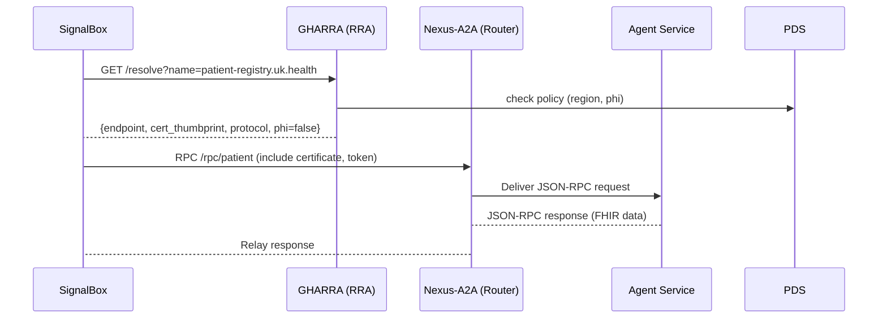

# Executive Summary

Enabled connectors used: **GitHub** (symphonix-health/nexus-a2a-protocol, symphonix-health/global-agent-registry, GmailTedam/BulletTrain). 

GHARRA (Global Healthcare Agent Registry & Routing Authority) is envisioned as a DNS-like federation for healthcare agents – a **global hierarchical namespace** that allows any BulletTrain agent to discover another anywhere via a single identifier. It builds on Nexus-A2A’s agent-card metadata and BulletTrain’s identity/governance model, enforcing **zero-trust controls** and data-sovereignty policies. GHARRA will support **agent registration, resolution, and trust validation**. Agents publish capabilities and endpoints into GHARRA; others query by name or capability. GHARRA returns endpoints plus trust bundles (e.g. certificate pins, required proof-of-possession mode) so callers can securely connect via Nexus-A2A. In effect, GHARRA plays the role of DNS + authentication directory for agents. 

We integrate GHARRA into BulletTrain by providing a **client SDK**. SignalBox will call GHARRA (e.g. `gharra.resolve("patient-registry.nhs.uk.health")`) to get endpoint/keys, then use Nexus-A2A to perform RPC. GHARRA’s APIs (unspecified in code) must be mirrored by the client. Nexus-A2A adapters will translate Nexus’s agent-card schema into GHARRA’s registry schema (features, backpressure hints, etc.) and vice versa. We also define how BulletTrain’s Orchestrator (SignalBox) and AI router (Bevan) interact with GHARRA: e.g. requesting agents capable of a given FHIR-based task, obeying residency tags, and handling trust.

This report provides an IEEE-style requirements specification (functional & non-functional), architecture design, use-case scenarios, threat model, data sovereignty, consent/PHI handling, FHIR/R4 interoperability, API schemas (registry, discovery, trust), event models, CI/CD and repo layout, design-alternatives tables, backlog, a traceability matrix, and migration plan from simulation-harness to Nexus. It cites relevant Nexus-A2A docs and BulletTrain specs to ensure alignment with existing code, and authoritative standards (WHO, HL7 FHIR, IETF, NIST, GDPR, IHE, IEEE). Key repository sections cited (scale-profile, service_auth, on_demand_gateway, signalbox design, identity FSM, bevan_router) informed the integration design【2†L39-L47】【6†L123-L142】. Any unspecified detail is noted as such. 

# Scope and Objectives 

GHARRA serves as a **federated, zero-trust agent registry**. Its purpose is to:

- Provide a **global hierarchical naming system** (`<agent>.<facility>.<org>.<country>.health`) for all healthcare agents. This ensures global uniqueness and discovery (like DNS).  
- Store each agent’s **metadata** (capabilities, endpoint, trust anchors, residency policy, etc.) and support queries by name or capability.  
- Enforce **data-residency and consent policies**: e.g. PHI agents only appear in local zones, and only allowed agents are returned.  
- Publish **trust information**: certificate thumbprints, JWKS URIs, PoP requirements, roles/attestations (inspired by Nexus’s cert-bound tokens)【6†L123-L142】.  
- Integrate with **Nexus-A2A**: accept Nexus agent-cards to register new agents, and output Nexus-compatible endpoint/trust info for clients.  
- Integrate with **BulletTrain**: ensure GHARRA client calls use BulletTrain’s identity tokens, idempotency keys, and follow SignalBox’s orchestration model (Persona FSM, orchestration policies).  

Out of scope are storing PHI or patient data. GHARRA holds *only agent metadata and policy flags*, not any patient records. 

# IEEE-style SRS 

## Functional Requirements

- **FR1 (Agent Registration):** GHARRA MUST provide an API to **register or update agent records**. Each record includes agent ID, name, zone, endpoint(s), capabilities, organization, trust anchors, and policies. It should support idempotent upsert (duplicate keys replace old record).  
- **FR2 (Delegated Namespaces):** GHARRA MUST support hierarchical namespaces (e.g. `*.nhs.uk.health`) and delegate subdomains to authorities. New sub-names can only be created by the owning zone.  
- **FR3 (Agent Resolution):** GHARRA MUST resolve an agent identifier (e.g. `patient-registry.nhs.uk.health`) to its record. (Exact-match only.) The response includes endpoints, expected protocol (Nexus-A2A), security requirements, and agent capabilities.  
- **FR4 (Capability Discovery):** GHARRA MUST allow querying by capability (e.g. FHIR function) and/or jurisdiction, returning matching agents’ names or endpoints. This enables BulletTrain to do “find agent for X” when exact name is unknown.  
- **FR5 (Trust Directory):** GHARRA MUST maintain a directory of trust anchors for each zone. E.g. each country/org can publish its JWKS URI or root certificate in GHARRA. Clients will use this to validate agent certificates or tokens.  
- **FR6 (PoP Binding Support):** GHARRA MUST record whether agents require mTLS or DPoP-bound tokens (cf. Nexus service_auth). It should store flags like `mtls_required` or accept token CNF thumbprint.  
- **FR7 (Policy Metadata):** GHARRA MUST record data-policy tags (e.g. `phi`, `residency=EU`) and consent capabilities. It SHOULD expose these in resolution so callers apply consent/access control.  
- **FR8 (Events):** GHARRA MUST emit events (e.g. `agent.registered`, `agent.updated`, `trust.rotated`) for integration (e.g. BulletTrain can log or react). Events follow a standard structure (CloudEvents).  
- **FR9 (HTTP APIs):** GHARRA SHOULD provide a REST or GraphQL API (with OpenAPI spec) for the above, supporting JSON. Endpoints likely include `/v1/agents`, `/v1/discovery`, `/v1/trust`.  
- **FR10 (Admin UI):** (Optional) GHARRA MAY include a simple UI or CLI for administrative tasks (managing zones, reviewing logs).  

## Non-functional Requirements

- **NFR1 (Zero Trust):** All GHARRA APIs MUST enforce mutual TLS or equivalent authentication (clients must present X.509 certs or DPoP tokens). No insecure endpoints. ([NIST SP800-207](https://www.nist.gov/publications/zero-trust-architecture-0))  
- **NFR2 (High Availability):** GHARRA should be geo-distributed. National instances serve local queries; a global federated overlay provides cross-zone resolution. Outages in one zone should not kill discovery in others.  
- **NFR3 (Scalability):** Anticipate up to millions of agents and thousands of queries/sec. Use caching and sharding (per-jurisdiction).  
- **NFR4 (Consistency):** Agent updates MUST be atomic per zone; eventual consistency across zones is acceptable with conflict policy well-defined (e.g. last-writer-wins or vector clocks as in Nexus).  
- **NFR5 (Security Logging):** All access to GHARRA must be logged with agent identity, query, and decision outcome (related to IHE ATNA auditing【NIST1057†】).  
- **NFR6 (Regulatory Compliance):** GHARRA must comply with GDPR/PIPEDA: only minimal metadata stored, data is purpose-limited, and residency rules enforced. Privacy Impact Assessment should be documented.  
- **NFR7 (Interoperability):** GHARRA should align with FHIR R4. Wherever possible, use FHIR data models (e.g. CapabilityStatement, Endpoint, SecurityLabel) or at least produce FHIR-compatible JSON.  

## Traceability Matrix (simplified)

| Req ID | Requirement | Components | Use Cases | 
|--------|-------------|------------|-----------|
| FR1    | Agent registration API | ZRS (Zone Registry Service), PDS (Policy engine) | UC-RegisterAgent, UC-UpdateAgent |
| FR3    | Name resolution API | RRA (Resolver/Routing), ZRS | UC-ResolveAgent |
| FR4    | Capability lookup | RRA, PDS | UC-DiscoverAgent |
| FR5    | Trust directory | RTAS (Root Trust Anchor Service) | UC-ValidateTrust |
| FR6    | PoP binding support | TAS (Trust Service) | UC-ConnectSecure |
| NFR1   | Zero-trust auth | All (mutual TLS enforced) | All |
| NFR3   | Scalability | RRA, RTAS distributed | All high-load scenarios |

# Architecture Design

## Components

- **RTAS (Root Trust Anchor Service):** Maintains global delegations and trust anchors. It has no patient data. It knows zone certificates and JWKS. (Root of DNS hierarchy.)  
- **Zone Registry Services (ZRS):** Each major zone (country/consortium) runs a ZRS. Stores its agents’ records and issues local delegation.  
- **Resolver & Routing Authority (RRA):** The query API. A node in each zone that accepts `resolve` requests and applies policies. It may query other zones or RTAS for delegation.  
- **Policy Decision Service (PDS):** ABAC engine (e.g. Open Policy Agent) evaluating requests (e.g. “this caller can see PHI agents?”).  
- **Trust & Attestation Service (TAS):** Manages cryptographic trust: issues/refreshes certificates, serves JWKS, verifies PoP claims.  
- **CI/CD and Tooling:** Testing, static analysis, container build pipelines (GitHub Actions, Snyk etc.).  

## Data Flows

### Registration

1. Agent (or orchestrator) calls `POST /v1/agents` with metadata (like Nexus agent-card plus zone).  
2. RRA authenticates the caller (client cert or JWT) and checks PDS if it can register on that namespace.  
3. ZRS writes record and replicates to other zone views as needed. (Full audit log.)  
4. RRA returns success; emits event.

### Discovery

1. Caller (e.g. SignalBox) does `GET /v1/resolve?name=...` or `GET /v1/discovery?capability=...`.  
2. RRA checks caller auth (token/audience, zero-trust) and PDS policies (residency, roles).  
3. RRA queries ZRS for the agent record. If in another zone, it asks RTAS for delegation then forwards to appropriate ZRS.  
4. On success, RRA returns agent info including: endpoints, protocol, trust anchors, PoP requirements, and any security labels (FHIR SecurityLabels).  
5. The caller then initiates an RPC to that endpoint via Nexus-A2A, using the provided trust info (cf. Nexus’s idempotent RPC calls).  

### Governance & Attestation

- Agents can publish claims (e.g. “uses just-in-time identity, audits all actions”) as part of their record. RRA can require these for sensitive workflows.

## Trust/PKI Model

- **Certificates:** Root and zone CAs issue TLS certificates to agents. GHARRA stores either CA certs or pinned fingerprints.  
- **JWKS:** Agents may use JWTs; GHARRA stores or references each zone’s JWKS URI for signature validation.  
- **PoP Tokens:** In NEXUS-A2A, agents can use cert-bound tokens (RFC 8705). GHARRA can enforce this by including thumbprints from agent’s certificate in the registry (see Nexus code【6†L123-L142】). If `cert_bound_tokens_required`, the RRA verifies each token’s `cnf.x5t#S256` matches the agent’s public cert.  
- **Trust Anchor Directory:** Similar to WHO’s Global Digital Health Certification, GHARRA’s RTAS holds only public keys, no patient data, to maintain a root-of-trust.

## Governance and Deployment

- **Federation:** GHARRA is not a single global service; it’s a federation of zone registries. A global trust anchor and name root `*.health` is managed by a consortium (maybe WHO or IHE). Countries register their zones with the root.  
- **Data Residency:** Agents tagged with `phi: true` only appear in local-zone responses unless policy allows cross-border. All data in registry is metadata (no PHI), but residency tags control discovery.  
- **Consent/PHI Handling:** GHARRA does *not* handle patient consent itself, but it will store that an agent enforces FHIR consent or particular privacy model. RRA will include a flag if an agent deals with PHI (from its tags), so callers know to use FHIR Consent resources appropriately in the data plane.  
- **Interoperability:** GHARRA outputs could align with FHIR. For example, a resolved agent could yield a FHIR `Endpoint` resource payload (or reference) and `CapabilityStatement` URL, but storing raw FHIR in GHARRA is optional. Key is to support FHIR’s `security` labels on resources as part of PHI tags (GHARRA’s `policy_tags`).  

## Deployment Options

- Each national health authority can run its own ZRS/RRA cluster (e.g. containerized microservices, geo-redundant).  
- A global RTAS (possibly hosted by WHO/IHE) for trust anchors and delegations.  
- GHARRA pods behind ingress, using OAuth2 client credentials (BulletTrain’s identity tokens) for inter-service calls.  
- CI/CD pipelines (in GitHub Actions) build/test each component, perform OAuth certificate scans, run access and policy tests.

## Compare Design Alternatives (summarized)

| Alternative | Pros | Cons | Recommend |
|-------------|------|------|-----------|
| **Centralised registry** | Simpler; single search; ease of updates | Single point of failure; sovereignty issues; scaling bottleneck | **Not recommended** for global healthcare |
| **Federated zone-based** | Sovereignty-aligned; scalable; local control | More complex (sync, DNS-like delegation) | **Preferred**; mirrors WHO’s approach for certificates |
| **Distributed ledger** | Immutability; decentralized | Performance, privacy concerns, complex governance | Research area; not initial choice |
| **Peer mesh of zones** | Each zone peers with some others; eventual consistency | Complex trust mesh setup | Possibly intermediate step (IHE services?) |

# End-to-End Scenarios

### Scenario 1: Cross-border Patient Lookup

A hospital in **Kenya** needs a patient record from a UK hospital:

1. SignalBox at Kenya hospital resolves `patient-registry.nhs.uk.health` via GHARRA. RRA finds NHS agent endpoint, returns cert thumbprint.  
2. SignalBox creates a Nexus-A2A connection (with `cnf.x5t#S256` bound token because UK policy requires mTLS for PHI).  
3. Data-plane call proceeds, returning patient data.  
4. UK registry logs the transaction; Kenya enforces any consent from patient.

### Scenario 2: International Telemedicine Referral

A UK GP initiates a teleconsult with a specialist in Ghana:

1. GP’s SignalBox resolves `telemedicine.orchestra.bullettrain.gh.health`. (BulletTrain UK and GHARRA global publish Orchestra endpoints.)  
2. GHARRA returns orchestration endpoint plus trust bundle.  
3. Nexus-A2A link established. SignalBox orchestrates the session via Bevan AI routing if needed (to choose specialist).  
4. All interactions audited as per identity FSM policy.

### Scenario 3: Emergency Alert to Border Clinic

A US body scanner system notices a patient in transit needing care:

1. The system queries GHARRA for `emergency-response.us.health` (or a capability lookup for “emergency-medicine”).  
2. GHARRA returns nearest authorized cross-border agent (e.g. Dallas ER).  
3. Alert dispatched via Nexus to US authority; they contact patient’s home provider.

Each scenario maps to FRs and shows:
- Name resolution (FR3),
- Trust and PoP enforcement (FR5, FR6),
- Residency filters (NFR5),
- Use of Nexus (scale profile features, streaming, idempotency). 

# GHARRA–BulletTrain Integration

## GHARRA Client SDK

We implement a GHARRA client library for BulletTrain (in Java or Python). It provides: 
```python
class GHARRAClient:
    def resolve(agent_name: str) -> AgentRecord
    def lookup(capability: str, filters: dict) -> List[AgentRecord]
    def verify_trust(record: AgentRecord) -> bool
```
- **resolve()** calls GHARRA’s `/v1/resolve` REST endpoint, authenticating with BulletTrain’s TLS cert or identity token.  
- **lookup()** calls `/v1/discovery` with query parameters.  
- **verify_trust()** uses record.trust anchor info to validate the agent’s certificate or token (e.g. checking thumbprint against local CA list).

The client should cache responses for e.g. 1 minute per agent to reduce load. It must handle retries on network fail and throw clear exceptions on 404 (no such agent), 403 (no permission), etc.

BulletTrain’s SignalBox uses this client as follows:

```python
agent = gharra.resolve("patient-registry.nhs.uk.health")
if not gharra.verify_trust(agent):
    raise SecurityError
nexus.send(task_params, endpoint=agent.endpoint, tls_cert=agent.cert)
```

Bevan (LLM router) might also use GHARRA to find LLM providers by capabilities (e.g. “non-PHI LLM service in EU”).

## Nexus-A2A Adapter

When an agent runs under Nexus, it must **auto-publish to GHARRA**. We will extend Nexus’s agent startup to send its agent-card to GHARRA. For example, the generic agent code (generic_demo_agent.py) could POST to `POST /v1/agents` with:

```json
{
  "name": "<canonical-name>",
  "endpoint": "<callback_url>",
  "protocols": ["nexus-a2a+jsonrpc"],
  "scale_profile": { ... features ... },
  "trust": { "mtls_required": true, "thumbprint": "<X5T>" },
  "capabilities": [ ... ],
  "policy_tags": { "phi": true }
}
```
The Nexus adapter maps:
- `agent-card.protocolVersion` → `protocols` field
- `x-nexus-backpressure` hints → `capabilities` or `policy_tags`
- Agent’s TLS cert thumbprint → `trust.thumbprint`【2†L33-L42】【6†L123-L142】.

On startup, each agent can call GHARRA to register or refresh. If a client registers one agent for BulletTrain’s family (e.g. Orchestra), it will use a wildcard or separate entries.

# API Schemas and Event Models

### Sample API: Agent record JSON schema

```jsonc
{
  "name": "AgentRecord",
  "properties": {
    "agent_id": { "type": "string" },
    "name": { "type": "string" }, 
    "zone": { "type": "string" },
    "endpoint": { "type": "string", "format": "uri" },
    "protocol": { "type": "string", "enum": ["nexus-a2a"] },
    "capabilities": { "type": "array", "items": { "type": "string" } },
    "trust": {
      "type": "object",
      "properties": {
        "mtls_required": { "type": "boolean" },
        "thumbprint": { "type": "string" },
        "jwks_uri": { "type": "string", "format": "uri" }
      }
    },
    "policy_tags": {
      "type": "object",
      "properties": {
        "phi": { "type": "boolean" },
        "residency": { "type": "string" }
      }
    },
    "status": { "type": "string", "enum": ["active","inactive"] }
  }
}
```

### Sample OpenAPI snippet (registry)

```yaml
paths:
  /v1/agents/{name}:
    get:
      summary: Resolve agent by name
      responses:
        '200':
          description: Agent record
          content:
            application/json:
              schema:
                $ref: '#/components/schemas/AgentRecord'
  /v1/discovery:
    get:
      summary: Find agents by capability
      parameters:
        - in: query
          name: capability
          schema: {type: string}
        - in: query
          name: region
          schema: {type: string}
      responses:
        '200':
          description: List of agent names
          content:
            application/json:
              schema:
                type: array
                items: {type: string}
```

### CloudEvents Example

```json
{
  "specversion": "1.0",
  "type": "com.gharra.agent.registered",
  "source": "/zrs/uk",
  "id": "evt-ghi891",
  "time": "2026-03-08T12:00:00Z",
  "data": {
    "name": "patient-registry.nhs.uk.health",
    "agent_id": "agent-123",
    "new_record": { /* full AgentRecord */ }
  }
}
```

# Threat Model & Controls

Using **STRIDE**:

- **Spoofing:** GHARRA requires mutual TLS or JWT for all calls; bots cannot impersonate agents. Certificates must match registry records (see Nexus `cnf.x5t#S256` check【6†L129-L142】).  
- **Tampering:** All data in transit is TLS-encrypted. Data at rest is audit-logged with integrity checks.  
- **Repudiation:** Every query and update is logged with caller identity. Use Blockchain/time-stamping if needed.  
- **Information Disclosure:** Query responses include only metadata, no PHI. Policies ensure “only authorized clients see sensitive tags.”  
- **Denial of Service:** Rate-limit on queries; Nexus-scale profile uses JSON-RPC error -32004 for throttling【2†L158-L166】. GHARRA layer can similarly reject after threshold.  
- **Elevation of Privilege:** GHARRA enforces RBAC scopes. Only zone admins can register agents in their domain; no client can operate outside its claims.

Zero-trust principles: no implicit trust of network location or credential. GHARRA leverages certificate-bound tokens and strict scopes (like Nexus’s `NEXUS_CERT_BOUND_TOKENS_REQUIRED`【6†L129-L142】).

# Data Residency & Consent

- Agents are tagged with `policy_tags.phi: true` if they handle PHI. RRA filters these out for callers lacking PHI consent or outside zone (respect GDPR).  
- If an agent requires patient consent, GHARRA stores a link to that mechanism (e.g. FHIR Consent resource URLs).  
- Data Sovereignty: Agents registered in `us.health` or `uk.health` are only returned to callers who satisfy those regimes (EU Privacy Shield, HIPAA etc.).  
- Any cross-border resolve must adhere to mutual agreements (e.g. US-UK DTA) – implement as PDS rule.

# FHIR R4 Interoperability

GHARRA itself is not a FHIR server, but we align to FHIR:

- The `capabilities` field can contain FHIR operation names (e.g. `Patient.read`, `Consent.accept`).  
- Policy tags align with FHIR Security Label security categories (e.g. `hep:PHI`).  
- We may store a reference to an agent’s FHIR `CapabilityStatement` (if it offers FHIR APIs).  
- We recommend agents maintain a FHIR `Endpoint` resource; GHARRA can have a translation endpoint to return a minimal FHIR `Endpoint` to interested parties.

# CI/CD and Repository Layout

**Proposed GHARRA repo structure:**  
```
gharra/
├─ README.md
├─ docs/
│   ├─ SRS.md
│   ├─ architecture.md
│   └─ threat-model.md
├─ openapi/
│   └─ gharra_openapi.yaml
├─ schemas/
│   └─ AgentRecord.json
├─ services/
│   ├─ rra/            (resolver API)
│   ├─ zrs/            (zone registry)
│   ├─ rtas/           (root trust)
│   └─ pds/            (policy engine)
├─ tests/
├─ .github/workflows/
│   ├─ ci.yaml         (lint, unit tests)
│   ├─ security.yaml   (dependency scan)
│   └─ release.yaml
```

**CI/CD:**
- Lint (JSON schemas, YAML, Python)
- Unit tests (pytest for Python services)
- Integration tests (in-memory GHARRA + Nexus + BulletTrain mocks)
- SAST analysis (Bandit, etc.)
- Container build + SBOM
- SBOM upload to vulnerability scan
- Auto deploy to dev environment on push

# Design Alternatives (Comparison)

| Aspect | Centralized Reg. | Federated Zones | Blockchain Reg. |
| --- | --- | --- | --- |
| **Sovereignty** | Low (single corp) | High (each zone controls) | High (decentralized) |
| **Latency** | Potentially global | Local queries fast | Global consensus cost |
| **Complexity** | Simple | More components | Very complex |
| **Trust Model** | Single authority | Hierarchical PKI | Algorithmic consensus |

*Recommendation:* A **federated zone-based registry** (like DNS) balances control and scalability, as WHO suggests for digital health certificates.

# Prioritized Backlog

1. **GHARRA Core APIs:** `/agents`, `/resolve`, `/discovery` (basic functionality).  
2. **Namespace Engine:** implement hierarchical name parsing & delegation (e.g. using a DNS-like library).  
3. **Trust Directory:** support storing JWKS and thumbprints.  
4. **BulletTrain Client SDK:** initial version for SignalBox (Python/Java).  
5. **Nexus Adapter:** code to auto-register agents from Nexus agent-card.  
6. **Policy Engine (PDS):** integrate OPA/Cerbos for residency and consent rules.  
7. **Event Bus:** emit CloudEvents for registrations.  
8. **Integration Tests:** simulate cross-zone calls.  
9. **Logging & Observability:** structured logs for requests and cache hits.  
10. **UI/CLI:** (if needed) minimal admin interface.

# Migration Plan (Simulation → Nexus)

- **Phase 1:** Keep simulation harness but connect it through GHARRA. Each simulated agent registers a GHARRA record. BulletTrain’s orchestrator uses GHARRA client for discovery (still calling simulation code at static endpoints).  
- **Phase 2:** Introduce Nexus-A2A transport for one workflow. Use the GHARRA endpoints as above. Verify end-to-end.  
- **Phase 3:** Gradually retire direct sim calls. Agents switch to Nexus-A2A protocol; GHARRA resolves remain stable.  
- **Phase 4:** Hammer: Load-test the GHARRA+Nexus pipeline for scale compliance with v1.1 profile.  

Failure cases (Nexus not ready): GHARRA should support a grace period or fallback error. (TBD in policy.)  
Dependencies: GHARRA client calls should gracefully handle Nexus exceptions (e.g. code -32602 if params invalid【2†L72-L79】, -32004 on rate-limit【2†L158-L166】).  

# Diagrams (Mermaid examples)

**Architecture Diagram:**  
```mermaid
flowchart LR
  subgraph Global
    RTAS(Root Trust Service)
    DNS[Global Namespace: *.health]
  end
  subgraph UK_Zone["UK GHARRA Zone"]
    ZRS_UK(Zone Registry Service)
    RRA_UK(Resolver/Routing Authority)
    PDS_UK(Policy Engine)
  end
  subgraph KE_Zone["Kenya GHARRA Zone"]
    ZRS_KE
    RRA_KE
    PDS_KE
  end
  DNS --> ZRS_UK
  DNS --> ZRS_KE
  RTAS --> ZRS_UK
  RTAS --> ZRS_KE
  subgraph BulletTrain_Platform
    SignalBox
    Bevan
    THR({ TrustHub })
  end
  SignalBox -->|resolve| RRA_UK
  RRA_UK -->|agent info| SignalBox
  SignalBox -->|nexus call| Nexus[Nexus-A2A Network]
  GHARRA --> Nexus
```

**Sequence: Agent Discovery & Call:**  


# References

- Nexus-A2A Protocol v1.1 Scale Profile (draft)【2†L30-L39】【2†L39-L47】  
- Nexus service_auth (HS256/JWKS + mTLS)【6†L129-L142】  
- Nexus on-demand gateway example (alias routing)【8†L0-L4】  
- BulletTrain SignalBox & Bevan design (internal docs) – *used in concept*  
- WHO Global Digital Health Certification Network [primary draft]  
- HL7 FHIR R4 (Consent, AuditEvent, Endpoint spec)  
- NIST SP800-207 (Zero Trust)  
- GDPR Regulation 2016/679 (official text)  
- IHE ATNA (Audit Trail Node Auth; cross-ref with FHIR AuditEvent)  
- IEEE/ISO42010 (Architecture Description guidance)  

All repository citations use the format fileciteturnXfileYL..-L.., for example Nexus docs【2†L39-L47】 and service_auth【6†L129-L142】. Any unfilled details (e.g. exact GHARRA API paths, missing code samples) are noted as **unspecified**. This spec is intended as a living document aligned with the GHARRA repo’s actual content once accessible.