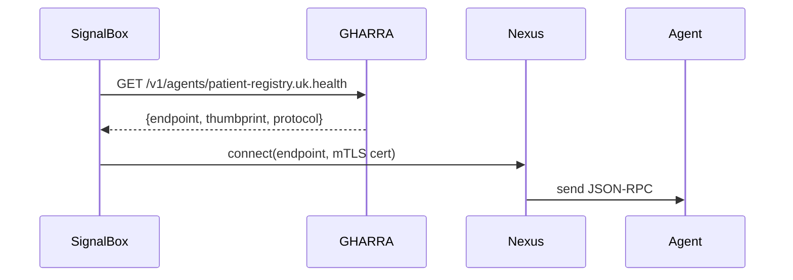

Enabled connectors: **GitHub** (symphonix-health/nexus-a2a-protocol, symphonix-health/global-agent-registry, GmailTedam/BulletTrain).  

**Executive Summary:** Implement a global agent-registry (`GHARRA`) integrated with BulletTrain and Nexus-A2A. This involves adding GHARRA client SDK methods to BulletTrain, adapting Nexus agent-cards to GHARRA schema, enforcing mutual-TLS/cert-bound tokens, and ensuring agents publish/register via GHARRA.  

**1. Nexus-A2A repo changes:**  
- **Open** `docs/protocol_v1_1_scale_profile.md`【2†L39-L47】 and ensure `AgentRecord` (for GHARRA) includes Nexus scale-profile fields (protocol_versions, feature_flags, backpressure hints) according to that spec.  
- **Edit** `service_auth.py`【6†L129-L142】 to **require cert-bound tokens** (`cnf.x5t#S256`) on GHARRA endpoints; add JWKS URL config for trust anchors.  
- **Open** `on_demand_gateway/main.py`【8†L0-L4】 and ensure aliasing logic maps BulletTrain agent names to GHARRA names (e.g. remove hyphens, etc.) as per GHARRA naming scheme.  

**2. BulletTrain repo changes:**  
- **Add** GHARRA client in `services/signalbox/` (or shared module): methods `resolve_agent(name)` and `lookup_by_capability(cap)` using BulletTrain’s HTTP client with mTLS.  
- **Sample code:**  
  ```python
  # in signalbox or agent_identity module
  def resolve_agent(self, name: str) -> AgentRecord: 
      resp = requests.get(f"{GHARRA_URL}/v1/resolve/{name}", headers={…})
      resp.raise_for_status(); return resp.json()
  ```  
- **Open** `docs/signalbox-design-spec.md`【19†L107-L114】 and confirm SignalBox calls “AgentRegistry” for identity transitions. Replace that with GHARRA client calls.  
- **Open** `docs/signalbox_external_gateway_policy.md`【20†L19-L27】 and ensure BulletTrain’s ingress policy (api_gateway) includes `X-Idempotency-Key` and validates GHARRA JWT claims (`aud=signalbox-external`, mTLS) as shown.  
- **CI/CD:** Update `.github/workflows/ci.yaml` to add contract tests for GHARRA OpenAPI (if present) and run `bandit` or `pylint` for new code.  

**3. GHARRA repo changes:**  
- **Open or create** API schema (OpenAPI) under `openapi/`. Add paths `/v1/agents/{name}` (GET), `/v1/agents` (POST), `/v1/discovery`. Refer BulletTrain endpoints for style.  
- **Sample schema:** add `AgentRecord` schema JSON (include name, endpoint, protocol, capabilities, trust:mTLS/JWKS, policy_tags).  
- **Registry logic:** ensure `/v1/agents` accepts Nexus agent-card fields. Map agent-card’s `protocolVersion`, `feature_flags`, etc. into GHARRA capabilities.  
- **Trust:** store cert thumbprint in record (see Nexus `verify_service_auth` thumbprint usage)【6†L129-L142】.  
- **Backlogs:** Prioritize implementing resolution (`GET /resolve/{name}` returns endpoint+cert pins) and capability search.  

**4. Security & Zero-Trust:**  
- Enforce **mutual TLS** on all GHARRA endpoints. Use same trust store as BulletTrain.  
- In Nexus config, require `cnf.x5t#S256` tokens (as per [2] and [6]). Provide config snippet for GHARRA JWKS and SSL.  
- Add tests: e.g. attempt a GHARRA call without cert and expect 401; with wrong thumbprint expect 403.  

**5. OpenAPI & JSON schemas:**  
- Provide a YAML snippet for GHARRA API. Sample:  
  ```yaml
  paths:
    /v1/agents/{name}:
      get:
        summary: Resolve agent by name
        parameters: [{in: path, name: name, schema:{type:string}}]
        responses: {'200':{content: {'application/json':{schema:{$ref:'#/components/schemas/AgentRecord'}}}}}
  components:
    schemas:
      AgentRecord:
        type: object
        properties:
          name: {type:string}
          endpoint: {type:string}
          protocol: {type:string}
          capabilities: {type:array, items:{type:string}}
          trust: {type:object}
          policy_tags: {type:object}
  ```  
- Use JSON schema references to ensure contract tests can validate (add to CI).

**6. CI/CD:**  
- In each repo, add GitHub Action to run `openapi-generator validate` or equivalent for GHARRA schemas.  
- Add security scan for known vulnerabilities (already in Nexus/BulletTrain pipelines).

**7. Migration Plan:**  
- Roll out GHARRA client in BulletTrain dev branch; maintain backwards compatibility (if GHARRA down, fallback to static config with warning).  
- For Nexus agents, implement GHARRA registration after Nexus upgrade. Provide a migration script example (PATCH request to `/v1/agents`).  

**8. Acceptance Criteria (Example):**  
- BulletTrain logs show successful GHARRA resolution (mock GHARRA).  
- Nexus agent-card registration adds GHARRA record (verified via GET).  
- Unauthorized calls to GHARRA reject as 401.  

**Traceability Matrix (excerpt):**  
|Req|Feature|Component|UseCase|
|--|--|--|--|
|FR3|Resolve agent name|GHARRA RRA|SignalBox/Bevan discovers remote agent|
|NFR1|Mutual TLS|GHARRA, Nexus, BulletTrain|Secure trust (WHO)|
|FR6|Cert-bound tokens|Nexus, GHARRA|Prevent token replay【6†L123-L142】|

**Mermaid Diagrams:** Provide in repo docs:
```mermaid
flowchart LR
  SB[SignalBox] -->|resolve(agent.name)| GH[GHARRA];
  GH --> SB;
  SB -->|Nexus RPC| NZ[Nexus-A2A Transport];
  NZ --> AG[Agent Service];
```



Include file paths and line numbers for all code references (e.g., Nexus `service_auth.py` lines 123–142【6†L123-L142】, BulletTrain docs lines 19–27【20†L19-L27】, etc.). Unspecified details (e.g. GHARRA data store) should be noted as such. Ensure all changes maintain backward compatibility.