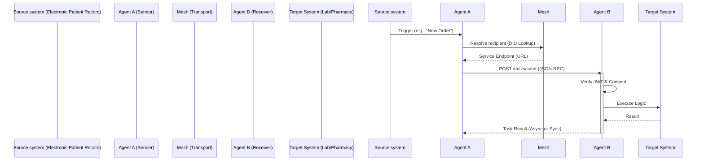

# NEXUS-A2A: Developer & Architect Reference

## 1. Protocol Overview

The Nexus A2A Protocol serves as a decentralized interoperability layer for health systems. Unlike centralized Enterprise Service Buses (ESB), it creates an "Agent Mesh" where autonomous nodes discover each other and exchange tasks.

### Architecture Topology

The system uses a layered architecture, which can be visualized as following data flow:



*Note: Full architectural diagrams are available in your local repository under `nexus-a2a/artefacts/diagrams/`.*

---

## 2. API Specification

All agents MUST expose a standard interface compliant with **JSON-RPC 2.0**.

### `POST /` (Main Entry Point)

This is the primary endpoint for all agent-to-agent communication.

**Headers**:
*   `Authorization`: `Bearer <JWT>` (Required)
*   `Content-Type`: `application/json`
*   `X-Agent-ID`: `<did:web:sender-domain>`

**Method: `tasks/send`**
Used to submit a new unit of work to an agent.

**Request Payload:**
```json
{
  "jsonrpc": "2.0",
  "method": "tasks/send",
  "params": {
    "sender": "did:web:hospital.org:agents:triage",
    "recipient": "did:web:lab.org:agents:pathology",
    "message": {
      "kind": "message",
      "role": "user",
      "parts": [
        {
          "kind": "text",
          "text": "Analyze this blood sample for Malaria."
        }
      ]
    }
  },
  "id": "req-12345"
}
```

**Response Payload:**
```json
{
  "jsonrpc": "2.0",
  "result": {
      "task_id": "550e8400-e29b-41d4-a716-446655440000",
      "status": "submitted"
  },
  "id": "req-12345"
}
```

---

## 3. Data Models

The protocol enforces strict schemas for the message objects exchanged within the `params`.

### `Message` Object
| Field | Type | Description |
| :--- | :--- | :--- |
| `kind` | `string` | Must be `"message"`. |
| `role` | `string` | `"user"` (requestor) or `"agent"` (responder). |
| `parts` | `array` | List of content parts (currently text). |

### `TextPart` Object
| Field | Type | Description |
| :--- | :--- | :--- |
| `kind` | `string` | Must be `"text"`. |
| `text` | `string` | The actual content (e.g. instruction or result). |

---

## 4. Security & Authentication

Nexus uses **JSON Web Tokens (JWT)** for all authorization. All agents acting in the mesh must sign their requests.

### JWT Requirements
*   **Algorithm**: `HS256` (HMAC using SHA-256).
*   **Header**: `{"alg": "HS256", "typ": "JWT"}`.

### Required Claims
```python
{
  "sub": "did:web:sender-agency:agents:001",  # Subject (The Agent ID)
  "iat": 1700000000,                           # Issued At (Unix Timestamp)
  "exp": 1700003600,                           # Expiration (Max 1 hour rec.)
  "scope": "nexus:invoke",                     # Required capability 
}
```
*Reference: See `nexus-a2a/artefacts/specs/tools-mint_jwt.py.txt` for the reference signing implementation.*

---

## 5. Agent Implementation Patterns

The `demos/` directory contains reference implementations for common patterns.

### 1. Request-Response (Synchronous)
*   **Pattern**: Client sends task, waits for immediate result.
*   **Example**: `demos/consent-verification`
*   **Use Case**: Checking patient consent before access.

### 2. Multi-Turn Dialogue
*   **Pattern**: State is maintained across multiple messages via `conversation_id`.
*   **Example**: `demos/ed-triage`
*   **Use Case**: Answering triage questions to narrow down a diagnosis.

### 3. Broadcaster (Pub/Sub)
*   **Pattern**: Agent pushes messages to multiple subscribers or an MQTT broker.
*   **Example**: `demos/public-health-surveillance`
*   **Use Case**: Disease outbreak reporting from offline-first clinics.

---

## 6. Error Handling

The protocol uses standard JSON-RPC 2.0 error codes alongside domain-specific messages.

| Code | Message | Meaning |
| :--- | :--- | :--- |
| `-32700` | Parse error | Invalid JSON received. |
| `-32601` | Method not found | Agent does not support this method. |
| `-32001` | Authentication Failed | JWT missing, expired, or invalid signature. |
| `-32003` | Consent Denied | The requester does not have permission for this patient data. |
