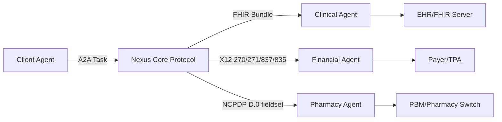
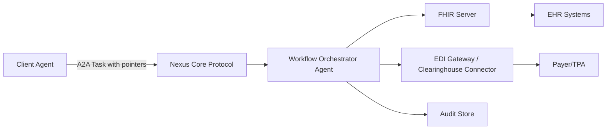
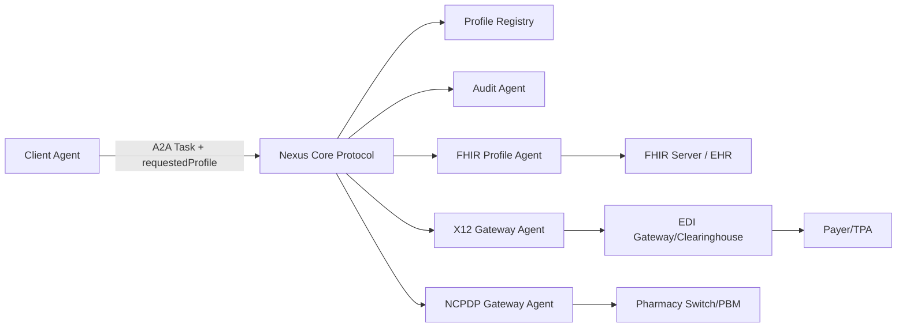

# Standards Embedding Strategy for Nexus A2A Protocol

Connectors used: `["github"]`

## Executive summary

I attempted to review the `symphonix-health/nexus-a2a-protocol` repository using the enabled entity["company","GitHub","code hosting platform"] connector first, as requested. I was able to access repository-level metadata (e.g., commit listings and comparisons), but file-content retrieval (README/docs/source files) was consistently blocked by safety controls in the connector runtime. Because I could not extract verifiable protocol details from the repo itself, I did **not** use or quote any repository file contents (so there are **no** repo file excerpts to cite). I treat anything “Nexus-specific” below as **inferred from the upstream A2A protocol** and clearly label it as such.

Given that constraint, I focus on the architectural decision you asked about: whether clinical and financial interoperability standards should be embedded in the protocol or handled separately. Based on primary sources from entity["organization","HL7","standards development org"] FHIR (including the Financial module and core exchange patterns), entity["organization","ASC X12","edi standards committee"] transaction-set definitions, entity["organization","Centers for Medicare & Medicaid Services","us health agency"] guidance on HIPAA-adopted transactions (U.S. example), entity["organization","NCPDP","pharmacy standards org"] adoption references, and entity["organization","IHE","interop profile org"] / entity["organization","ISO","international standards org"] security/audit practices, I recommend a **hybrid-profiles approach**:

- Keep a **standards-neutral Nexus/A2A core** (tasking, transport, streaming, identity, correlation, replay, audit hooks).
- Add **versioned profile envelopes** for healthcare domains (e.g., `health.fhir.r4`, `health.fhir.r4.financial`, `health.x12.5010`, `health.ncpdp.telecom.d0`) and implement them through **adapter agents/gateways** rather than hard-wiring FHIR/X12/NCPDP semantics into the base protocol.
- Use profile negotiation + registry + conformance tests (in the style of an A2A TCK) so clients can discover which agents can do which healthcare exchanges.

This aligns with how the entity["organization","HL7","standards development org"] Da Vinci Prior Authorization Support guide describes real-world payer/provider interoperability: FHIR-based requests can be exchanged directly, and when regulatory/trading-partner requirements demand X12, an intermediary can translate FHIR to X12 and back. citeturn4search5

## Nexus A2A protocol design summary from available evidence

### What I could and could not verify from the repo

- I **could** access commit-level metadata (lists and compare summaries), which confirms the repo exists and is active.
- I **could not** retrieve the README, docs, or source files through the connector. That prevented me from extracting authoritative statements about:
  - the exact “Nexus” message schema,
  - supported transports and endpoints,
  - extension conventions,
  - security mechanisms implemented (as opposed to recommended),
  - version negotiation rules,
  - concrete examples embedded in the repo.

Because of that, the most defensible way to answer your question is to treat `nexus-a2a-protocol` as an implementation or specialization of the **Agent2Agent (A2A)** protocol family and take protocol characteristics from the public A2A material.

### Baseline protocol characteristics inferred from upstream A2A

The public A2A description emphasizes:
- **Transport and wire patterns**: built on HTTP with Server-Sent Events (SSE) and JSON-RPC as core building blocks. citeturn3search0  
- **Capability discovery**: “Agent Cards” in JSON that advertise capabilities. citeturn3search0  
- **Task-oriented lifecycle**: a Task object with lifecycle states for short and long-running work. citeturn3search0  
- **Message ‘parts’**: structured message parts that let agents negotiate UI/format. citeturn3search0  
- **Registry usage** (common in A2A networks): the A2A Registry describes JSON-RPC as primary and REST as secondary, supporting registration/discovery based on A2A Protocol v0.3.0. citeturn3search2  
- **Conformance testing**: the A2A TCK positions itself as a multi-transport compliance harness for A2A v0.3.0. citeturn3search7  

### Protocol element comparison table

The table below is the **best-fit mapping** between (a) what upstream A2A materials state and (b) what a healthcare-ready “Nexus” specialization typically needs. Anything in the “Nexus assumption” column should be validated against the repo when file access is possible.

| Protocol element | A2A baseline (public) | Nexus assumption for healthcare readiness | Why it matters for HL7/FHIR + X12/NCPDP |
|---|---|---|---|
| Message format | JSON-RPC mentioned as a building block; structured “parts” in messages citeturn3search0turn3search2 | A stable envelope with `taskId`, `correlationId`, `message.parts[]`, plus `artifacts[]` for payloads | Lets you carry FHIR Bundles and EDI payloads as artifacts without redefining the base protocol |
| Transport | HTTP + SSE called out citeturn3search0 | HTTP endpoints with optional streaming (SSE) for long-running claims/auth workflows | Eligibility/prior-auth/claim adjudication are often asynchronous; streaming improves UX and operability |
| Capability discovery | Agent Card in JSON citeturn3search0 | Agent Card extended with healthcare “profiles” and supported versions | Enables profile-based routing: “send this X12 270 to an X12 agent”, “send this FHIR Bundle to a FHIR agent” |
| Long-running tasks | Explicitly supported citeturn3search0 | Task states + checkpointing + resumable workflows | Prior auth and claims can involve multi-step gathering of clinical attachments and retries |
| Extensibility | “parts” concept implies typed content citeturn3search0 | Healthcare-specific part types: `fhirBundle`, `x12Edi`, `ncpdpTelecom`, `documentReference`, `binaryAttachment` | You need clean extension points to avoid baking regulated formats into the core |
| Security posture | “Security by default” and enterprise auth mentioned citeturn3search0 | JWT/OIDC for user/service identity; optional mTLS for node identity; auditable authorization decisions | Healthcare needs strong identity, least privilege, and verifiable audit trails; SMART-on-FHIR provides concrete OAuth/TLS expectations citeturn2search4turn2search2 |
| Versioning | A2A v0.3.0 referenced in registry/TCK materials citeturn3search2turn3search7 | SemVer for core + SemVer per “profile” (FHIR R4 vs R4B vs R5; X12 5010 vs later; NCPDP D.0 vs D.3) | Healthcare standards evolve on different cadences; keeping versioning orthogonal reduces breakage |

## Where clinical and financial flows enter the protocol

### A practical model: “payloads ride inside tasks”

In a task-based A2A/Nexus pattern, healthcare exchanges typically enter as either:
1) **structured artifacts** (FHIR JSON, X12 EDI text, NCPDP field sets), or  
2) **references** (URLs/IDs to retrieve from a FHIR server/EDI store), with the task carrying pointers plus audit metadata.

FHIR explicitly supports bundling resources for message exchange, including a “message” Bundle type where the first resource is a `MessageHeader`. citeturn0search1  
FHIR also defines a Financial module with resources such as `CoverageEligibilityRequest`, `Claim`, `ClaimResponse`, and `ExplanationOfBenefit`. citeturn0search0turn0search5  

On the financial EDI side, entity["organization","ASC X12","edi standards committee"] describes transaction sets with clear business purposes: 270/271 (eligibility), 278 (services review/prior auth), 837 (claim), 835 (payment/remittance), 834 (enrollment). citeturn0search3turn0search2turn5search3turn5search1turn5search6  
In the U.S., entity["organization","Centers for Medicare & Medicaid Services","us health agency"] summarizes HIPAA adopted transaction standards and explicitly calls out NCPDP D.0 for retail pharmacy transactions. citeturn1search1turn1search0  

### Lifecycle events and likely payloads

| Lifecycle event | Clinical data likely present (FHIR) | Financial/admin data likely present (FHIR + X12/NCPDP) | Where it enters an A2A/Nexus task |
|---|---|---|---|
| Patient registration | `Patient`, `RelatedPerson`, `Organization`, `Location` | Coverage on file: `Coverage` (FHIR) | Task “intake/register”: FHIR Bundle artifact; optional pointer to source EHR |
| Encounter start | `Encounter`, `Condition`, `Observation` (triage) | Eligibility check trigger | Task “encounter/open”: FHIR Bundle + “eligibility-needed=true” |
| Orders placed | `ServiceRequest`, `MedicationRequest`, `Procedure` | “Is prior auth required?” (payer rules) | Task “order/submit”: FHIR artifacts; may spawn “prior-auth” sub-task |
| Results posted | `Observation`, `DiagnosticReport`, attachments | Supporting documentation for authorization or claim | Task “results/post”: FHIR artifacts + documents |
| Eligibility check | n/a or supporting context | FHIR `CoverageEligibilityRequest/Response`; X12 270/271 | Task “coverage/eligibility”: profile `health.x12.5010.270` or `health.fhir.*.eligibility` |
| Prior authorization | clinical packet (conditions, observations, orders, notes) | X12 278 or FHIR-based PAS bundles | Task “coverage/prior-auth”: either direct FHIR PAS exchange or translate to X12 278 via gateway citeturn4search5turn4search1 |
| Claim submission | coded services/products tied to clinical record | FHIR `Claim`; X12 837 | Task “billing/claim-submit”: 837 artifact or Claim artifact mapped to payer requirements |
| Claim status | clinical minimal | X12 276/277; FHIR claim status patterns | Task “billing/claim-status”: query/response loop |
| Remittance ingestion | n/a | X12 835; FHIR `ExplanationOfBenefit` / `ClaimResponse` | Task “billing/remit-ingest”: 835 artifact → mapped into EOB for internal analytics/patient views citeturn5search1turn0search5 |
| Pharmacy claim (POS) | medication order context | NCPDP Telecom D.0 claim | Task “pharmacy/pos-claim”: NCPDP field-set artifact; optional mapping to FHIR Claim internally citeturn1search1turn1search4 |

## Embedding standards vs handling separately

### Ground realities that shape the decision

- FHIR provides canonical resource models for clinical and financial workflows (including claims and eligibility). citeturn0search0turn0search5  
- X12 and NCPDP standards are often **licensed** for full implementation-guide access (a practical barrier to hard-wiring details into open protocol specs and test fixtures). X12 explicitly states that access to certain TR3 resources requires a commercial/internal/developer license. citeturn5search2turn5search5  
- In regulated settings (U.S. example), CMS ties electronic transactions to adopted standards from ASC X12N or NCPDP. citeturn1search0turn1search1  
- Real-world payer-provider interoperability frequently needs an **intermediary translation layer**: the Da Vinci PAS IG spells out that FHIR interfaces can go to an intermediary that converts to X12 where needed, and responses come back via the reverse conversion. citeturn4search5  

### Comparative analysis across the requested dimensions

| Dimension | Embed HL7/FHIR + X12/NCPDP into the protocol | Keep standards separate via profiles + adapters (recommended direction) |
|---|---|---|
| Technical | **Pros:** Single “one true payload type” per workflow; fewer moving pieces in small deployments. **Cons:** Base protocol becomes domain-specific; changes in FHIR releases/IGs and X12/NCPDP versions create protocol churn; harder to keep core stable across verticals. citeturn0search0turn3search7 | **Pros:** A smaller stable core; adapters own mapping complexity; supports multiple versions in parallel; aligns with A2A’s capability discovery and TCK-style compliance. citeturn3search0turn3search7 |
| Operational | **Pros:** Fewer deployed services if everything is inside one stack. **Cons:** Operational blast radius is large; every healthcare change forces redeploying the protocol runtime; harder on-call because protocol bugs and mapping bugs look identical. | **Pros:** Clear separation: protocol reliability vs mapping correctness; teams can own “X12 gateway” vs “FHIR profile agent”; easier to roll back a mapping release without touching core. |
| Regulatory | **Pros:** You can enforce “only compliant payloads allowed” at the protocol boundary. **Cons:** Different jurisdictions adopt different rules; embedding U.S.-centric constraints into base protocol makes global use harder; plus X12/NCPDP licensing complicates shipping conformance fixtures openly. citeturn1search1turn5search2turn5search5 | **Pros:** You can implement jurisdiction-specific compliance in adapters and load payer-specific companion guides without changing protocol semantics; core remains jurisdiction-neutral. CMS’s framing (U.S.) helps illustrate how standards selection is jurisdictional. citeturn1search1turn1search0 |
| Performance | **Pros:** Potentially fewer transformations if everyone speaks the embedded standard. **Cons:** Large payloads (FHIR bundles + attachments) can stress the protocol layer; protocol loses ability to optimize transport generically. citeturn0search1 | **Pros:** You can choose when to pass-by-reference (URLs) vs inline; adapters can do streaming, chunking, compression, batching tuned to X12/FHIR characteristics. |
| Auditability | **Pros:** One place to log everything. **Cons:** Audit often needs system-level and domain-level events; mixing them can reduce clarity. | **Pros:** Core can emit “envelope-level” audit (task received/sent, authZ decision, replay); adapters emit “domain-level” audit. This matches IHE ATNA’s view: node authentication + secure communications + event logging as foundations. citeturn1search7turn1search46 |
| Migration | **Pros:** If you control both ends, you can evolve in lockstep. **Cons:** In payer/provider ecosystems, you rarely control both ends; embedding leads to hard breaking changes when FHIR IGs evolve or when X12/NCPDP versions shift. | **Pros:** Versioned adapters let you run “old payer profile” and “new payer profile” side by side; aligns with the PAS pattern where translation can be switched on/off under specific compliance regimes. citeturn4search5turn4search1 |

## Implementation options with diagrams and mapping tables

### Option A: Embedded standards inside the Nexus protocol

This option makes the Nexus protocol itself “healthcare-native”: every agent must understand FHIR Bundles and specific X12/NCPDP payload forms.



**When it works well:** a single vendor ecosystem, limited trading partners.

**Compatibility note:** It is hard to ship robust conformance tests if they require licensed X12/NCPDP guides (you can still test syntax and basic invariants, but deep segment rules often depend on licensed TR3s). citeturn5search2turn5search5  

### Option B: Standards handled entirely outside; Nexus transports only references

Here, Nexus carries “work intents” plus pointers (e.g., FHIR server URLs, EDI file IDs), and all standards handling happens in dedicated systems.



**Strength:** very stable core protocol.

**Trade-off:** you lose some “portable interoperability” because messages are now environment-specific pointers; cross-organization workflows require shared access patterns and trust setup.

### Option C: Hybrid profiles with versioned adapter agents (recommended)

Nexus stays standards-neutral but supports **profile negotiation** and standardized artifact containers. Domain-specific agents perform translation/validation.



**Why this matches healthcare reality:** Da Vinci PAS explicitly expects the “FHIR ↔ X12 when necessary” translation role to exist as an intermediary capability. citeturn4search5  

### Data mapping table (illustrative, not payer-specific)

Because X12/NCPDP segment-level rules are payer- and guide-dependent (often companion-guide driven) and some implementation guides are licensed, I’m treating the segment mappings as **illustrative scaffolding** rather than normative rules. citeturn5search2turn5search5  

| Workflow | FHIR resource(s) | X12 transaction / typical anchors | NCPDP (where relevant) | Recommended Nexus payload pattern |
|---|---|---|---|---|
| Eligibility | `CoverageEligibilityRequest` → `CoverageEligibilityResponse` citeturn0search0turn0search7 | 270 request / 271 response citeturn0search3turn0search2 | n/a | `artifact.type=x12Edi` (270/271) **or** `artifact.type=fhirBundle`; profile decides |
| Prior auth | PAS bundle(s) plus clinical attachments; often order context citeturn4search5turn0search1 | 278 (commonly) citeturn5search0 | SCRIPT ePA for Part D (U.S. example) citeturn1search3turn1search5 | Prefer `artifact.type=fhirBundle` in-provider workflows; use X12 adapter when required (profile-specific) |
| Claim submission | `Claim` (and related clinical context) citeturn0search5 | 837 claim citeturn5search3 | pharmacy POS is usually NCPDP, not 837 | For professional/institutional: `artifact.type=x12Edi` (837) or `fhirBundle` `Claim`; adapter produces payer-ready format |
| Remittance | `ClaimResponse` and/or `ExplanationOfBenefit` citeturn0search5 | 835 remittance/payment citeturn5search1turn5search2 | n/a | Ingest 835 as `x12Edi`; adapter maps to EOB for internal use |
| Pharmacy POS claim | optional internal mapping to `Claim` | n/a | NCPDP Telecom D.0 (U.S. example adoption) citeturn1search1turn1search4 | `artifact.type=ncpdpTelecom`; adapter emits/receives NCPDP field sets |

### Migration and compatibility considerations

- **Profile versioning is mandatory**: FHIR R4 vs R4B vs R5 differences matter, and payer IGs pin versions; X12 transactions are versioned (e.g., 5010) and linked to operating rules in some jurisdictions. citeturn1search1turn0search6  
- **Parallel-run strategy**: run multiple adapter versions side-by-side (e.g., `x12.837.5010.v1` and `x12.837.5010.v2`) and use Agent Card discovery to route. citeturn3search0turn3search2  
- **Audit and security should be uniform across profiles**: use a consistent baseline (JWT/OIDC, TLS, event logging) even if payload formats vary. SMART-on-FHIR includes concrete requirements around TLS and session `state` handling. citeturn2search4turn2search2  
- **Healthcare security governance**: ISO 27799:2025 frames health-specific security controls based on ISO/IEC 27002 and applies to information “in all its aspects” including transfer/exchange—useful guidance when you design Nexus audit + secure transport expectations. citeturn2search0turn2search6  

## Recommended approach, risk mitigation, and validation checklist

### Recommendation

I recommend the **hybrid-profiles approach (Option C)**:

1) A standards-neutral Nexus/A2A core that stays stable,  
2) a profile registry and negotiation mechanism, and  
3) versioned adapter agents for:
   - clinical FHIR exchange + profiling,
   - X12 gateway (270/271/276/277/278/834/837/835 as needed),
   - NCPDP gateway (Telecom D.0; optionally SCRIPT for ePA/eRx in jurisdictions where required).

This mirrors the Da Vinci PAS model where intermediaries translate between FHIR and X12 when necessary, while also supporting direct FHIR exchange when allowed. citeturn4search5turn4search1  

### Risk mitigation

- **Regulatory drift**: Keep jurisdiction rules in adapter configuration. (CMS pages show standards and dates change over time; treat them as config, not code.) citeturn1search0turn1search1  
- **Standard/IP licensing**: Ensure your CI artifacts avoid redistributing licensed implementation guides; use synthetic examples and conformance assertions that check structural invariants. X12 notes licensing for TR3 access. citeturn5search2turn5search5  
- **Security and audit gaps**: Adopt IHE ATNA-style baseline controls: node authentication, secure communications, event logging, and governance. citeturn1search7turn1search46  
- **Interoperability failures from partial mappings**: Da Vinci PAS explicitly notes segments/use cases not fully mapped; expect gaps and track them as profile limitations with explicit declarations in Agent Cards. citeturn4search7turn3search0  

### Testing and validation checklist

I would implement a two-layer harness:

- **Layer one: Protocol conformance**
  - Agent Card discovery works and advertises supported profiles/versions. citeturn3search0turn3search2  
  - Task lifecycle: create/update/cancel; streaming updates via SSE when used. citeturn3search0  
  - Idempotency and replay: same `correlationId` yields safe reprocessing behavior (no duplicate side effects).
  - Authentication: JWT validation; TLS-only for token-bearing flows (SMART-on-FHIR expectations are a good bar). citeturn2search4turn2search2  

- **Layer two: Domain conformance**
  - FHIR JSON schema + profile validation for the declared IG/profile set (e.g., CRD/DTR/PAS where relevant). citeturn4search5turn4search1turn0search1  
  - X12 syntax validation and transaction-type checks (270/271/837/835 intent and direction). citeturn0search3turn0search2turn5search3turn5search1  
  - NCPDP D.0 structural checks; SCRIPT flows where applicable (jurisdiction-specific). citeturn1search1turn1search5  
  - AuditEvent emission (or equivalent audit record) for each inbound/outbound exchange; recommended alignment with ATNA’s event logging stance. citeturn1search7  

## Claude-style implementation prompt for the hybrid-profiles approach

```text
You are a senior staff engineer implementing a “hybrid-profiles” healthcare interoperability layer on top of a standards-neutral Nexus A2A core.

GOAL
Build: (1) a stable A2A-compatible Nexus core envelope and runtime hooks, (2) versioned healthcare “profile adapters” as separate agents/services, and (3) a CI conformance harness that validates protocol + healthcare payload flows.

ARCHITECTURE CONSTRAINTS
- Nexus Core MUST be standards-neutral: it does task routing, streaming, authn/authz, correlation, replay protection, and audit hooks. It MUST NOT embed healthcare-specific semantics.
- Healthcare standards support MUST be implemented via versioned adapter agents:
  - FHIR Profile Agent (FHIR R4 baseline; allow extension for R4B/R5 in future)
  - X12 Gateway Agent (support 270/271, 278, 837, 835, 276/277, 834 as modular plugins)
  - NCPDP Gateway Agent (Telecom D.0; optionally SCRIPT ePA/eRx modules behind feature flags)
- Implement a Profile Registry that supports:
  - profile identifiers (e.g., health.fhir.r4.core, health.fhir.r4.financial, health.x12.5010.270, health.x12.5010.837p, health.x12.5010.835, health.ncpdp.telecom.d0)
  - versioning (SemVer)
  - capability discovery integration (Agent Card style): adapters declare supported profiles, versions, and constraints
- Implement an Audit Agent that records:
  - envelope-level events (task received/sent/failed/retried)
  - domain-level events (eligibility checked, claim submitted, remittance ingested, pharmacy claim transmitted)
  - security events (authn/authz decisions, token validation, mTLS session details if enabled)

SECURITY
- Default: JWT/OIDC for service identity
- Optional: mTLS between agents (node identity / defense-in-depth)
- All token-bearing HTTP calls MUST be over TLS
- Enforce least privilege scopes at adapter boundaries (e.g., “claims.submit”, “eligibility.read”, “fhir.write”, “ncpdp.submit”)
- Log security-relevant events to Audit Agent with correlationId

DELIVERABLES (COMPONENTS TO BUILD)
1) Nexus Core Extensions
   - Profile negotiation: requestedProfile + acceptableProfiles list
   - Artifact container: parts that can carry typed payloads
   - Correlation and replay controls
   - On-demand gateway hooks: allow Nexus to invoke an adapter agent when a profile is requested
   - Standard error envelope (problem+json-like): code, message, details, retryable, correlationId

2) FHIR Profile Agent
   - Accepts FHIR JSON resources and Bundles
   - Validates against minimal schema + declared profiles
   - Supports mapping into canonical “Nexus Healthcare Event” internal model:
     - patient.registration
     - encounter.open / encounter.close
     - order.create
     - result.post
     - coverage.eligibility.request/response
     - priorauth.request/response
     - claim.submit / claim.response
     - remit.ingest

3) X12 Gateway Agent
   - Accepts typed artifacts for 270/271, 278, 837, 835, 276/277, 834
   - Performs:
     - basic EDI syntax validation
     - transaction classification (which X12 set is it)
     - mapping to/from canonical Nexus Healthcare Event model
   - Output modes:
     - “pass-through” (store-and-forward)
     - “translate from FHIR canonical model” (FHIR->X12)
     - “translate to FHIR canonical model” (X12->FHIR)
   - Adapter must be configurable by “trading partner profile” (payer-specific rules) without code changes (config files)

4) NCPDP Gateway Agent
   - Accepts NCPDP Telecom claim as structured fieldset artifact (do NOT require a licensed spec to run tests)
   - Validates required minimal fields (BIN, PCN, Group, Cardholder ID, Rx number, NDC, quantity, days supply, prescriber ID, pharmacy ID, fill number)
   - Maps to/from canonical Nexus Healthcare Event model
   - Support response parsing (paid/reject + reject codes)

5) Profile Registry
   - CRUD for profiles and versions
   - Resolution rules:
     - exact match on requestedProfile
     - fallback to highest compatible SemVer within acceptableProfiles
   - Maintains mapping between profile -> adapter endpoint(s)

6) Audit Agent
   - Ingests audit events from all components
   - Stores immutable logs (append-only)
   - Provides query API by correlationId, patientId (hashed), encounterId, claimId, time window

7) CI Conformance Harness
   - Protocol-level tests (A2A-style):
     - agent discovery
     - task lifecycle
     - streaming (if enabled)
     - idempotency/replay behavior
     - authn/authz failure modes
     - audit events emitted
     - profile negotiation correctness
   - Domain-level tests:
     - FHIR validation smoke tests
     - mapping transforms (FHIR <-> canonical model <-> X12/NCPDP)
     - negative tests (missing fields, invalid IDs, inconsistent references)

TEST SCENARIOS (END-TO-END)
A) Patient encounter clinical flows
   1. Registration:
      - create Patient
      - create Coverage (optional)
   2. Encounter:
      - create Encounter
   3. Orders:
      - create ServiceRequest (lab)
      - create MedicationRequest (optional)
   4. Results:
      - create Observation
      - create DiagnosticReport referencing Observation

B) Eligibility check
   - Input: minimal CoverageEligibilityRequest (FHIR)
   - Adapter path:
     - FHIR Profile Agent validates
     - X12 Gateway Agent translates to “illustrative” 270 request
     - returns “illustrative” 271 response -> mapped back to CoverageEligibilityResponse

C) Prior authorization (simplified)
   - Input: PAS-like FHIR Bundle (Message or Transaction bundle)
   - If profile indicates “x12 required”:
     - translate to “illustrative” 278 request
     - translate response back to FHIR canonical model + produce a tracking id

D) Claim submission and adjudication
   - Input: FHIR Claim for the Encounter/ServiceRequest
   - Translate to “illustrative” 837
   - Simulate payer adjudication response
   - Produce ClaimResponse and/or ExplanationOfBenefit
   - Ingest “illustrative” 835 remittance and map into EOB

E) Pharmacy claim flow (POS)
   - Input: NCPDP Telecom structured fieldset
   - Validate required minimal fields
   - Simulate paid response with paid amount OR reject with reject code
   - Map key response fields into canonical model, plus optional FHIR Claim for internal record

CONCRETE TEST VECTORS (ILLUSTRATIVE; KEEP MINIMAL)
1) Minimal FHIR JSON (either standalone or as Bundle entries)
   - Patient (id, name, gender, birthDate)
   - Encounter (id, status, class, subject=Patient, period)
   - Observation (id, status, code, subject, effectiveDateTime, valueQuantity/valueString)
   - ServiceRequest (id, status, intent, code, subject, encounter)
   - CoverageEligibilityRequest (id, status, purpose=["benefits"], patient, created, insurer, provider, insurance.coverage)
   - Claim (id, status, type, use, patient, created, insurer, provider, priority, item with product/service code)
   Note: Provide these as JSON fixtures in testdata/fhir/*.json.

2) Example X12 snippets (illustrative only)
   - 270 (eligibility inquiry) skeleton:
     ISA*...~
     GS*HS*...~
     ST*270*0001~
     BHT*0022*13*...~
     HL*1**20*1~
     NM1*PR*2*PAYER NAME*****PI*12345~
     HL*2*1*21*1~
     NM1*1P*2*PROVIDER NAME*****XX*9876543210~
     HL*3*2*22*0~
     NM1*IL*1*DOE*JOHN****MI*W000000000~
     DTP*291*D8*20260101~
     EQ*30~
     SE*...~
     GE*...~
     IEA*...~
   - 271 (eligibility response) skeleton with EB segment presence.
   - 837 claim skeleton with CLM and minimal service line.
   - 835 remittance skeleton with BPR/TRN/CLP/CAS presence.
   Note: Put in testdata/x12/*.edi.

3) Example NCPDP Telecom fieldset (illustrative)
   - Header:
     BIN, PCN, Group, CardholderID, PatientDOB, PatientGender
   - Claim:
     RxNumber, FillNumber, NDC, Quantity, DaysSupply, DAW, PrescriberID, PharmacyNPI
   - Response:
     Status=Paid|Reject, RejectCodes[], PaidAmount, PatientPayAmount
   Note: Store in testdata/ncpdp/*.json.

ACCEPTANCE CRITERIA (CI CHECKS)
- Schema validation:
  - FHIR JSON parses and passes minimal FHIR structural validation
  - X12/NCPDP artifacts pass structural invariants
- Profile negotiation:
  - Given requestedProfile + acceptableProfiles, registry resolves deterministically
  - Agent Card lists actual supported profiles; CI rejects drift
- Idempotency:
  - Re-submitting same correlationId does not duplicate external side-effects
- Replay:
  - “Replay” mode reuses stored artifacts and re-emits only safe events
- Audit:
  - Every task produces:
    - task.received
    - task.routed
    - task.completed OR task.failed
    - domain events when adapters run
  - Audit entries include correlationId, profileId, actor, timestamp, outcome
- Error handling:
  - Standard error envelope returned for:
    - invalid payload
    - unsupported profile
    - auth failure
    - downstream timeout
  - retryable flag set correctly
- Security:
  - Reject missing/invalid JWT
  - Enforce TLS-only for token-bearing calls
  - Optional mTLS: fail closed if enabled and peer cert missing
- Performance smoke:
  - Process minimal flows within reasonable latency budgets (configurable thresholds)

IMPLEMENTATION NOTES (MAPPING + OPERATIONS)
- Use a canonical internal event model to decouple standards:
  - patient, encounter, order, result, eligibility, priorauth, claim, remit, pharmacyClaim
- Mapping rules:
  - Prefer stable identifiers; keep crosswalk tables (FHIR id <-> external ids)
  - Support attachments by reference first; inline only if small
  - Normalize code systems (CPT/HCPCS/LOINC/RxNorm/NDC) without hard-coding jurisdiction rules
- Logging:
  - Structured logs with correlationId everywhere
  - Redact PHI in logs; store sensitive payloads in protected artifact store
- Deployment:
  - Each adapter agent can scale independently
  - Registry and Audit are shared services
  - Provide helm/k8s manifests or docker-compose for local CI

Now produce:
1) A repo folder structure proposal
2) Interface contracts (JSON schemas) for the Nexus envelope and artifact parts
3) Pseudocode or reference implementation stubs for each agent
4) The full CI test plan + fixtures layout + example fixtures
5) A “happy path” and “failure path” walkthrough for each scenario
```